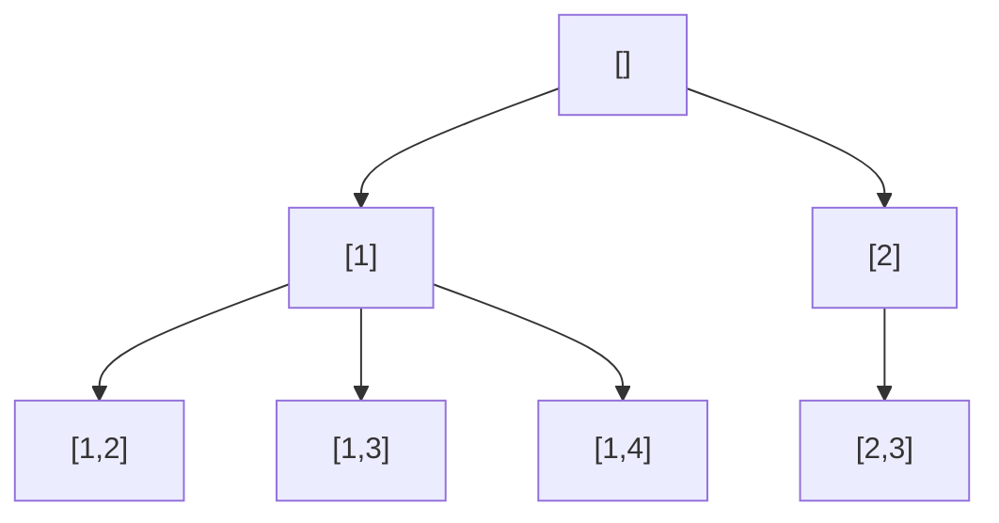

# 77. Combinations

**Difficulty:** Medium
**Category:** Backtracking

## Problem

Given two integers `n` and `k`, return all possible combinations of `k` numbers chosen from the range `[1, n]`. You may return the answer in any order.

### Example 1

```
Input: n = 4, k = 2
Output: [[1,2],[1,3],[1,4],[2,3],[2,4],[3,4]]
```



### Example 2

```
Input: n = 1, k = 1
Output: [[1]]
```

### Constraints

- `1 <= n <= 20`
- `1 <= k <= n`

## Approach

Backtrack, choosing numbers in increasing order starting from a `start` value to avoid duplicate combinations (never look backward). Prune early: if the remaining numbers available (`n - start + 1`) can't fill out the rest of the combination, stop exploring that branch.

## C# Solution

```csharp
public class Solution
{
    public IList<IList<int>> Combine(int n, int k)
    {
        var result = new List<IList<int>>();
        Backtrack(1, n, k, new List<int>(), result);
        return result;
    }

    private void Backtrack(int start, int n, int k, List<int> current, List<IList<int>> result)
    {
        if (current.Count == k)
        {
            result.Add(new List<int>(current));
            return;
        }

        int remainingNeeded = k - current.Count;

        for (int i = start; i <= n - remainingNeeded + 1; i++)
        {
            current.Add(i);
            Backtrack(i + 1, n, k, current, result);
            current.RemoveAt(current.Count - 1);
        }
    }
}
```

## Complexity

- **Time:** `O(k * C(n, k))` — `C(n, k)` combinations, each costing `O(k)` to copy.
- **Space:** `O(k)` for recursion depth, excluding the output.
