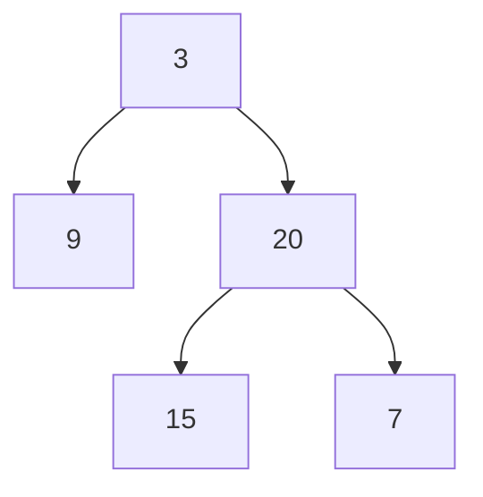

# 106. Construct Binary Tree from Inorder and Postorder Traversal

**Difficulty:** Medium
**Category:** Array, Hash Table, Divide and Conquer, Tree, Binary Tree

## Problem

Given two integer arrays `inorder` and `postorder` where `inorder` is the inorder traversal of a binary tree and `postorder` is the postorder traversal of the same tree, construct and return the binary tree.

### Example 1

```
Input: inorder = [9,3,15,20,7], postorder = [9,15,7,20,3]
Output: [3,9,20,null,null,15,7]
```



### Example 2

```
Input: inorder = [-1], postorder = [-1]
Output: [-1]
```

### Constraints

- `1 <= inorder.length <= 3000`
- `postorder.length == inorder.length`
- `inorder` and `postorder` consist of unique values.

## Approach

The last element of `postorder` is always the current subtree's root. Locate it in `inorder` (via a dictionary for `O(1)` lookup) to split into left/right subtree ranges. Build the right subtree first (consuming from the end of `postorder` backward), then the left subtree, since `postorder` visits right before left when read in reverse.

## C# Solution

```csharp
public class Solution
{
    private Dictionary<int, int> inorderIndex;
    private int[] postorder;
    private int postorderIndex;

    public TreeNode BuildTree(int[] inorder, int[] postorder)
    {
        this.postorder = postorder;
        postorderIndex = postorder.Length - 1;
        inorderIndex = new Dictionary<int, int>();

        for (int i = 0; i < inorder.Length; i++)
        {
            inorderIndex[inorder[i]] = i;
        }

        return Build(0, inorder.Length - 1);
    }

    private TreeNode Build(int inorderLeft, int inorderRight)
    {
        if (inorderLeft > inorderRight) return null;

        int rootVal = postorder[postorderIndex--];
        var root = new TreeNode(rootVal);
        int mid = inorderIndex[rootVal];

        root.right = Build(mid + 1, inorderRight);
        root.left = Build(inorderLeft, mid - 1);

        return root;
    }
}
```

## Complexity

- **Time:** `O(n)` — each node is created once, with `O(1)` lookups via the dictionary.
- **Space:** `O(n)` — for the dictionary and recursion depth.
