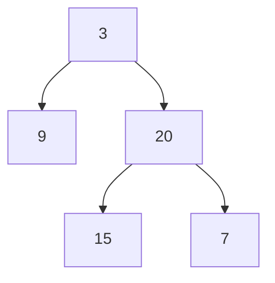

# 105. Construct Binary Tree from Preorder and Inorder Traversal

**Difficulty:** Medium
**Category:** Array, Hash Table, Divide and Conquer, Tree, Binary Tree

## Problem

Given two integer arrays `preorder` and `inorder` where `preorder` is the preorder traversal of a binary tree and `inorder` is the inorder traversal of the same tree, construct and return the binary tree.

### Example 1

```
Input: preorder = [3,9,20,15,7], inorder = [9,3,15,20,7]
Output: [3,9,20,null,null,15,7]
```



### Example 2

```
Input: preorder = [-1], inorder = [-1]
Output: [-1]
```

### Constraints

- `1 <= preorder.length <= 3000`
- `inorder.length == preorder.length`
- `preorder` and `inorder` consist of unique values.

## Approach

The first element of `preorder` is always the current subtree's root. Find that value's position in `inorder` — everything to its left belongs to the left subtree, and everything to its right belongs to the right subtree. Recurse on the corresponding slices, tracking indices instead of allocating new arrays, and use a dictionary for `O(1)` lookups of a value's position in `inorder`.

## C# Solution

```csharp
public class Solution
{
    private Dictionary<int, int> inorderIndex;
    private int[] preorder;
    private int preorderIndex;

    public TreeNode BuildTree(int[] preorder, int[] inorder)
    {
        this.preorder = preorder;
        preorderIndex = 0;
        inorderIndex = new Dictionary<int, int>();

        for (int i = 0; i < inorder.Length; i++)
        {
            inorderIndex[inorder[i]] = i;
        }

        return Build(0, inorder.Length - 1);
    }

    private TreeNode Build(int inorderLeft, int inorderRight)
    {
        if (inorderLeft > inorderRight) return null;

        int rootVal = preorder[preorderIndex++];
        var root = new TreeNode(rootVal);
        int mid = inorderIndex[rootVal];

        root.left = Build(inorderLeft, mid - 1);
        root.right = Build(mid + 1, inorderRight);

        return root;
    }
}
```

## Complexity

- **Time:** `O(n)` — each node is created once, with `O(1)` lookups via the dictionary.
- **Space:** `O(n)` — for the dictionary and recursion depth.
