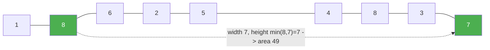

# 11. Container With Most Water

**Difficulty:** Medium
**Category:** Array, Two Pointers, Greedy

## Problem

You are given an integer array `height` of length `n`. There are `n` vertical lines drawn such that the two endpoints of the `i`-th line are `(i, 0)` and `(i, height[i])`.

Find two lines that together with the x-axis form a container that holds the most water.

Return the maximum amount of water a container can store.

### Example 1

```
Input: height = [1,8,6,2,5,4,8,3,7]
Output: 49
Explanation: lines at index 1 (height 8) and index 8 (height 7) hold min(8,7) * (8-1) = 49.
```



### Example 2

```
Input: height = [1,1]
Output: 1
```

### Constraints

- `n == height.length`
- `2 <= n <= 10^5`
- `0 <= height[i] <= 10^4`

## Approach

Start with two pointers at the outer edges of the array. The area is limited by the shorter line, so move the pointer at the shorter line inward — moving the taller one can never increase the area since width only shrinks. Track the best area seen while the pointers converge.

## C# Solution

```csharp
public class Solution
{
    public int MaxArea(int[] height)
    {
        int left = 0, right = height.Length - 1;
        int maxArea = 0;

        while (left < right)
        {
            int width = right - left;
            int area = Math.Min(height[left], height[right]) * width;
            maxArea = Math.Max(maxArea, area);

            if (height[left] < height[right]) left++;
            else right--;
        }

        return maxArea;
    }
}
```

## Complexity

- **Time:** `O(n)` — each pointer moves at most `n` times total.
- **Space:** `O(1)`.
