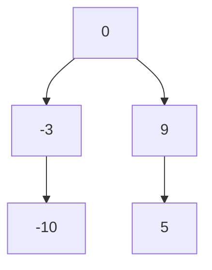

# 108. Convert Sorted Array to Binary Search Tree

**Difficulty:** Easy
**Category:** Array, Divide and Conquer, Tree, Binary Search Tree, Binary Tree

## Problem

Given an integer array `nums` sorted in ascending order, convert it to a height-balanced binary search tree.

### Example 1

```
Input: nums = [-10,-3,0,5,9]
Output: [0,-3,9,-10,null,5]
```



### Example 2

```
Input: nums = [1,3]
Output: [3,1]
```

### Constraints

- `1 <= nums.length <= 10^4`
- `nums` is sorted in strictly increasing order.

## Approach

Recursively pick the middle element of the current sorted range as the subtree's root — this naturally balances the tree since roughly half the remaining elements fall on each side. Recurse into the left half (before the middle) and the right half (after the middle) to build the subtrees.

## C# Solution

```csharp
public class Solution
{
    public TreeNode SortedArrayToBST(int[] nums)
    {
        return Build(nums, 0, nums.Length - 1);
    }

    private TreeNode Build(int[] nums, int left, int right)
    {
        if (left > right) return null;

        int mid = left + (right - left) / 2;
        var root = new TreeNode(nums[mid]);

        root.left = Build(nums, left, mid - 1);
        root.right = Build(nums, mid + 1, right);

        return root;
    }
}
```

## Complexity

- **Time:** `O(n)` — every element becomes exactly one node.
- **Space:** `O(log n)` — recursion depth for a balanced tree, excluding the output.
