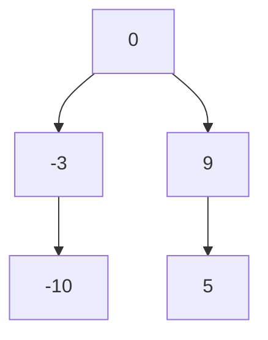

# 109. Convert Sorted List to Binary Search Tree

**Difficulty:** Medium
**Category:** Linked List, Divide and Conquer, Tree, Binary Search Tree, Binary Tree

## Problem

Given the `head` of a singly linked list where elements are sorted in ascending order, convert it to a height-balanced binary search tree.

### Example 1

```
Input: head = [-10,-3,0,5,9]
Output: [0,-3,9,-10,null,5]
```



### Example 2

```
Input: head = []
Output: []
```

### Constraints

- The number of nodes in the list is in the range `[0, 2 * 10^4]`.
- `-10^5 <= Node.val <= 10^5`

## Approach

Convert the linked list to an array first (a single `O(n)` pass), then build a balanced BST from the sorted array using the middle-element recursion from Convert Sorted Array to BST. This avoids the awkwardness of repeatedly finding a linked list's middle node with slow/fast pointers at every recursion level.

## C# Solution

```csharp
public class Solution
{
    public TreeNode SortedListToBST(ListNode head)
    {
        var values = new List<int>();
        while (head != null)
        {
            values.Add(head.val);
            head = head.next;
        }

        return Build(values, 0, values.Count - 1);
    }

    private TreeNode Build(List<int> values, int left, int right)
    {
        if (left > right) return null;

        int mid = left + (right - left) / 2;
        var root = new TreeNode(values[mid]);

        root.left = Build(values, left, mid - 1);
        root.right = Build(values, mid + 1, right);

        return root;
    }
}
```

## Complexity

- **Time:** `O(n)` — one pass to build the array, one pass to build the tree.
- **Space:** `O(n)` — for the intermediate array.
