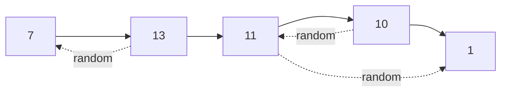

# 138. Copy List with Random Pointer

**Difficulty:** Medium
**Category:** Hash Table, Linked List

## Problem

A linked list is given where each node contains an additional `random` pointer which could point to any node in the list, or `null`. Construct a deep copy of the list.

### Example 1

```
Input: head = [[7,null],[13,0],[11,4],[10,2],[1,0]]
Output: [[7,null],[13,0],[11,4],[10,2],[1,0]]
Explanation: each pair is [value, index of the node its random pointer targets, or null].
```



### Example 2

```
Input: head = [[1,1],[2,1]]
Output: [[1,1],[2,1]]
```

### Constraints

- The number of nodes is in the range `[0, 1000]`.
- `-10^4 <= Node.val <= 10^4`
- `Node.random` is `null` or points to some node in the linked list.

## Approach

Use a dictionary mapping each original node to its clone. In a first pass, create every clone node (with its value only) and record the mapping. In a second pass, walk the original list again and wire up each clone's `next` and `random` pointers using the dictionary — since every original node has already been cloned, the mapping is guaranteed complete by the second pass.

## C# Solution

```csharp
public class Node
{
    public int val;
    public Node next;
    public Node random;
    public Node(int val)
    {
        this.val = val;
        next = null;
        random = null;
    }
}

public class Solution
{
    public Node CopyRandomList(Node head)
    {
        if (head == null) return null;

        var cloneOf = new Dictionary<Node, Node>();

        for (var node = head; node != null; node = node.next)
        {
            cloneOf[node] = new Node(node.val);
        }

        for (var node = head; node != null; node = node.next)
        {
            cloneOf[node].next = node.next != null ? cloneOf[node.next] : null;
            cloneOf[node].random = node.random != null ? cloneOf[node.random] : null;
        }

        return cloneOf[head];
    }
}
```

## Complexity

- **Time:** `O(n)` — two linear passes.
- **Space:** `O(n)` — for the clone dictionary.
