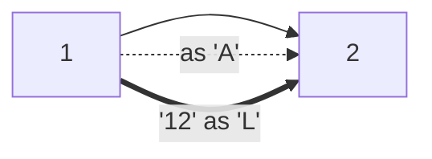

# 91. Decode Ways

**Difficulty:** Medium
**Category:** String, Dynamic Programming

## Problem

A message containing letters `A-Z` is encoded using the mapping `'A' -> "1"`, `'B' -> "2"`, ..., `'Z' -> "26"`. Given a string `s` containing only digits, return the number of ways to decode it.

### Example 1

```
Input: s = "12"
Output: 2
Explanation: "12" could be decoded as "AB" (1 2) or "L" (12).
```



### Example 2

```
Input: s = "226"
Output: 3
Explanation: "226" could be decoded as "BZ" (2 26), "VF" (22 6), or "BBF" (2 2 6).
```

### Constraints

- `1 <= s.length <= 100`
- `s` consists of digits and may contain leading zero(s).

## Approach

`dp[i]` is the number of ways to decode the first `i` characters. A single digit contributes `dp[i-1]` ways if it's non-zero (`'0'` alone can't be decoded). The last two digits together contribute `dp[i-2]` ways if they form a valid two-digit code (`"10"`-`"26"`). Sum both contributions at each position; this can be compressed to track only the last two DP values.

## C# Solution

```csharp
public class Solution
{
    public int NumDecodings(string s)
    {
        if (s.Length == 0 || s[0] == '0') return 0;

        int prev2 = 1; // dp[i-2], base case dp[0] = 1
        int prev1 = 1; // dp[i-1], dp[1] = 1 since s[0] != '0'

        for (int i = 1; i < s.Length; i++)
        {
            int current = 0;

            if (s[i] != '0')
            {
                current += prev1;
            }

            int twoDigit = (s[i - 1] - '0') * 10 + (s[i] - '0');
            if (twoDigit >= 10 && twoDigit <= 26)
            {
                current += prev2;
            }

            prev2 = prev1;
            prev1 = current;
        }

        return prev1;
    }
}
```

## Complexity

- **Time:** `O(n)` — single pass.
- **Space:** `O(1)` — only the last two DP values are tracked.
