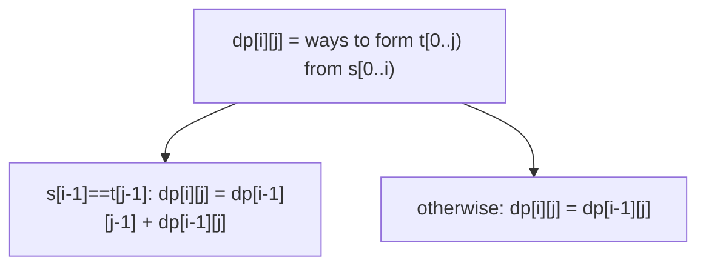

# 115. Distinct Subsequences

**Difficulty:** Hard
**Category:** String, Dynamic Programming

## Problem

Given two strings `s` and `t`, return the number of distinct subsequences of `s` which equal `t`.

### Example 1

```
Input: s = "rabbbit", t = "rabbit"
Output: 3
Explanation: Three ways to choose characters from s to spell "rabbit" (differing by which 'b' is skipped).
```



### Example 2

```
Input: s = "babgbag", t = "bag"
Output: 5
```

### Constraints

- `1 <= s.length, t.length <= 1000`
- `s` and `t` consist of English letters.

## Approach

`dp[i][j]` counts the number of ways to form `t`'s first `j` characters using `s`'s first `i` characters. Every character of `s` can either be skipped (`dp[i-1][j]` ways carry over) or, if it matches `t[j-1]`, also used to extend a match (`+ dp[i-1][j-1]` ways). The base case `dp[i][0] = 1` reflects that the empty string can always be formed (by skipping everything).

## C# Solution

```csharp
public class Solution
{
    public int NumDistinct(string s, string t)
    {
        int m = s.Length, n = t.Length;
        var dp = new long[m + 1, n + 1];

        for (int i = 0; i <= m; i++) dp[i, 0] = 1;

        for (int i = 1; i <= m; i++)
        {
            for (int j = 1; j <= n; j++)
            {
                dp[i, j] = dp[i - 1, j];

                if (s[i - 1] == t[j - 1])
                {
                    dp[i, j] += dp[i - 1, j - 1];
                }
            }
        }

        return (int)dp[m, n];
    }
}
```

## Complexity

- **Time:** `O(m * n)` — fills the DP table once.
- **Space:** `O(m * n)` — for the DP table (reducible to `O(n)` with row compression).
