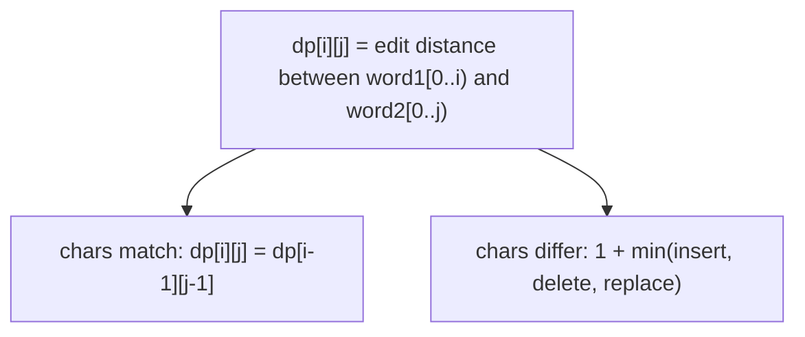

# 72. Edit Distance

**Difficulty:** Medium
**Category:** String, Dynamic Programming

## Problem

Given two strings `word1` and `word2`, return the minimum number of operations required to convert `word1` to `word2`. You have three operations permitted on a word: insert a character, delete a character, or replace a character.

### Example 1

```
Input: word1 = "horse", word2 = "ros"
Output: 3
Explanation: horse -> rorse (replace 'h' with 'r') -> rose (remove 'r') -> ros (remove 'e')
```



### Example 2

```
Input: word1 = "intention", word2 = "execution"
Output: 5
```

### Constraints

- `0 <= word1.length, word2.length <= 500`
- `word1` and `word2` consist of lowercase English letters.

## Approach

Classic DP: `dp[i][j]` is the edit distance between the first `i` characters of `word1` and the first `j` characters of `word2`. If the current characters match, no operation is needed (`dp[i-1][j-1]`). Otherwise, take `1 +` the minimum of insert (`dp[i][j-1]`), delete (`dp[i-1][j]`), or replace (`dp[i-1][j-1]`).

## C# Solution

```csharp
public class Solution
{
    public int MinDistance(string word1, string word2)
    {
        int m = word1.Length, n = word2.Length;
        var dp = new int[m + 1, n + 1];

        for (int i = 0; i <= m; i++) dp[i, 0] = i;
        for (int j = 0; j <= n; j++) dp[0, j] = j;

        for (int i = 1; i <= m; i++)
        {
            for (int j = 1; j <= n; j++)
            {
                if (word1[i - 1] == word2[j - 1])
                {
                    dp[i, j] = dp[i - 1, j - 1];
                }
                else
                {
                    dp[i, j] = 1 + Math.Min(dp[i - 1, j - 1], Math.Min(dp[i - 1, j], dp[i, j - 1]));
                }
            }
        }

        return dp[m, n];
    }
}
```

## Complexity

- **Time:** `O(m * n)` — fills the DP table once.
- **Space:** `O(m * n)` — for the DP table (reducible to `O(min(m, n))` with row compression).
