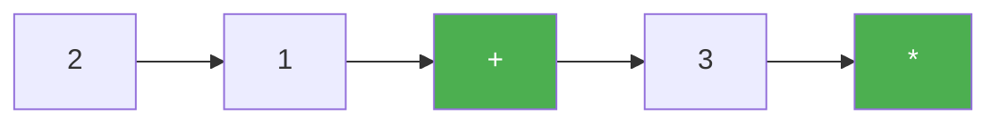

# 150. Evaluate Reverse Polish Notation

**Difficulty:** Medium
**Category:** Array, Math, Stack

## Problem

Evaluate the value of an arithmetic expression given in Reverse Polish Notation (postfix notation), represented as a list of tokens where operands and operators (`+`, `-`, `*`, `/`) are given in postfix order. Division between two integers truncates toward zero.

### Example 1

```
Input: tokens = ["2","1","+","3","*"]
Output: 9
Explanation: (2 + 1) * 3 = 9.
```



### Example 2

```
Input: tokens = ["4","13","5","/","+"]
Output: 6
Explanation: 4 + (13 / 5) = 4 + 2 = 6.
```

### Constraints

- `1 <= tokens.length <= 10^4`
- Each token is an operator (`+`, `-`, `*`, `/`) or an integer.

## Approach

Use a stack: push every operand encountered. When an operator is encountered, pop the top two operands (the second-popped is the left-hand operand), apply the operator, and push the result back. After processing all tokens, the stack holds exactly one value — the final result.

## C# Solution

```csharp
public class Solution
{
    public int EvalRPN(string[] tokens)
    {
        var stack = new Stack<int>();

        foreach (var token in tokens)
        {
            if (token == "+" || token == "-" || token == "*" || token == "/")
            {
                int right = stack.Pop();
                int left = stack.Pop();

                int result = token switch
                {
                    "+" => left + right,
                    "-" => left - right,
                    "*" => left * right,
                    "/" => left / right,
                    _ => throw new InvalidOperationException(),
                };

                stack.Push(result);
            }
            else
            {
                stack.Push(int.Parse(token));
            }
        }

        return stack.Pop();
    }
}
```

## Complexity

- **Time:** `O(n)` — single pass over the tokens.
- **Space:** `O(n)` — for the stack.
