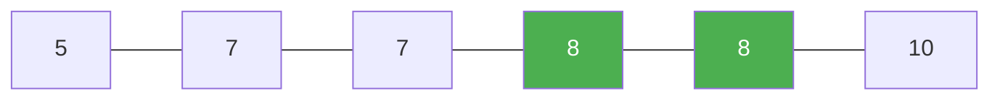

# 34. Find First and Last Position of Element in Sorted Array

**Difficulty:** Medium
**Category:** Array, Binary Search

## Problem

Given an array of integers `nums` sorted in non-decreasing order, find the starting and ending position of a given `target` value. If `target` is not found, return `[-1, -1]`. You must write an algorithm with `O(log n)` runtime complexity.

### Example 1

```
Input: nums = [5,7,7,8,8,10], target = 8
Output: [3,4]
```



### Example 2

```
Input: nums = [5,7,7,8,8,10], target = 6
Output: [-1,-1]
```

### Constraints

- `0 <= nums.length <= 10^5`
- `-10^9 <= nums[i] <= 10^9`
- `nums` is a non-decreasing array.
- `-10^9 <= target <= 10^9`

## Approach

Run two separate binary searches: one biased to find the leftmost index where `target` could be inserted (lower bound), and one biased to find the leftmost index where `target + 1` could be inserted (upper bound). If the lower bound index is out of range or doesn't hold `target`, no match exists.

## C# Solution

```csharp
public class Solution
{
    public int[] SearchRange(int[] nums, int target)
    {
        int first = LowerBound(nums, target);
        if (first == nums.Length || nums[first] != target) return new[] { -1, -1 };

        int last = LowerBound(nums, target + 1) - 1;
        return new[] { first, last };
    }

    private int LowerBound(int[] nums, int target)
    {
        int lo = 0, hi = nums.Length;

        while (lo < hi)
        {
            int mid = lo + (hi - lo) / 2;
            if (nums[mid] < target) lo = mid + 1;
            else hi = mid;
        }

        return lo;
    }
}
```

## Complexity

- **Time:** `O(log n)` — two binary searches.
- **Space:** `O(1)`.
