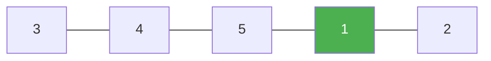

# 153. Find Minimum in Rotated Sorted Array

**Difficulty:** Medium
**Category:** Array, Binary Search

## Problem

Suppose an array of distinct integers, sorted in ascending order, is rotated at some unknown pivot. Given the rotated array `nums`, return the minimum element. You must write an algorithm with `O(log n)` runtime complexity.

### Example 1

```
Input: nums = [3,4,5,1,2]
Output: 1
```



### Example 2

```
Input: nums = [4,5,6,7,0,1,2]
Output: 0
```

### Constraints

- `n == nums.length`
- `1 <= n <= 5000`
- All the values of `nums` are unique.
- `nums` was originally sorted and then possibly rotated.

## Approach

Binary search comparing the middle element to the rightmost element: if `nums[mid] > nums[hi]`, the minimum must be somewhere to the right of `mid` (the rotation point is in the right half), so move `lo` past `mid`; otherwise the minimum is at `mid` or to its left, so shrink `hi` down to `mid`.

## C# Solution

```csharp
public class Solution
{
    public int FindMin(int[] nums)
    {
        int lo = 0, hi = nums.Length - 1;

        while (lo < hi)
        {
            int mid = lo + (hi - lo) / 2;

            if (nums[mid] > nums[hi])
            {
                lo = mid + 1;
            }
            else
            {
                hi = mid;
            }
        }

        return nums[lo];
    }
}
```

## Complexity

- **Time:** `O(log n)` — standard binary search halving.
- **Space:** `O(1)`.
