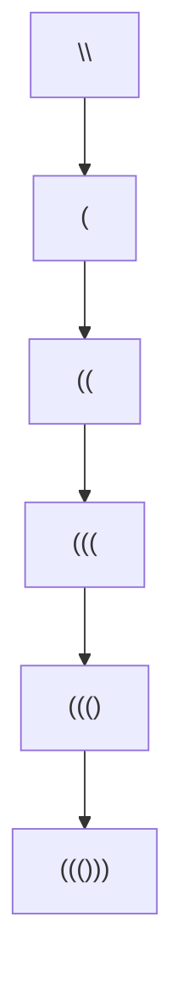

# 22. Generate Parentheses

**Difficulty:** Medium
**Category:** String, Dynamic Programming, Backtracking

## Problem

Given `n` pairs of parentheses, write a function to generate all combinations of well-formed parentheses.

### Example 1

```
Input: n = 3
Output: ["((()))","(()())","(())()","()(())","()()()"]
```



### Example 2

```
Input: n = 1
Output: ["()"]
```

### Constraints

- `1 <= n <= 8`

## Approach

Backtrack while building the string, tracking the count of open and close brackets used so far. Only add `'('` if fewer than `n` opens have been used, and only add `')'` if fewer closes than opens have been used so far — this guarantees every generated string is well-formed.

## C# Solution

```csharp
public class Solution
{
    public IList<string> GenerateParenthesis(int n)
    {
        var result = new List<string>();
        Backtrack(result, new StringBuilder(), 0, 0, n);
        return result;
    }

    private void Backtrack(List<string> result, StringBuilder current, int open, int close, int max)
    {
        if (current.Length == max * 2)
        {
            result.Add(current.ToString());
            return;
        }

        if (open < max)
        {
            current.Append('(');
            Backtrack(result, current, open + 1, close, max);
            current.Length--;
        }

        if (close < open)
        {
            current.Append(')');
            Backtrack(result, current, open, close + 1, max);
            current.Length--;
        }
    }
}
```

## Complexity

- **Time:** `O(4^n / sqrt(n))` — bounded by the `n`-th Catalan number of valid combinations.
- **Space:** `O(n)` for recursion depth, excluding the output.
