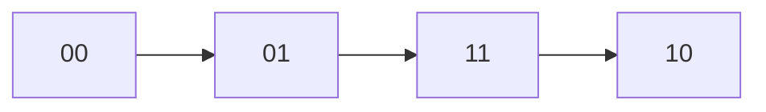

# 89. Gray Code

**Difficulty:** Medium
**Category:** Math, Backtracking, Bit Manipulation

## Problem

An `n`-bit gray code sequence is a sequence of `2^n` integers where every integer is in the range `[0, 2^n - 1]`, the first integer is `0`, each integer appears exactly once, and every pair of adjacent integers differs by exactly one bit. Given `n`, return any valid `n`-bit gray code sequence.

### Example 1

```
Input: n = 2
Output: [0,1,3,2]
Explanation: 00 -> 01 -> 11 -> 10, each step changes exactly one bit.
```



### Example 2

```
Input: n = 1
Output: [0,1]
```

### Constraints

- `1 <= n <= 16`

## Approach

The standard binary-reflected gray code formula gives the `i`-th value directly as `i ^ (i >> 1)`, without needing recursion or backtracking: this XOR trick guarantees consecutive values differ by exactly one bit.

## C# Solution

```csharp
public class Solution
{
    public IList<int> GrayCode(int n)
    {
        var result = new List<int>(1 << n);

        for (int i = 0; i < (1 << n); i++)
        {
            result.Add(i ^ (i >> 1));
        }

        return result;
    }
}
```

## Complexity

- **Time:** `O(2^n)` — one value generated per output element.
- **Space:** `O(1)` extra, excluding the output.
