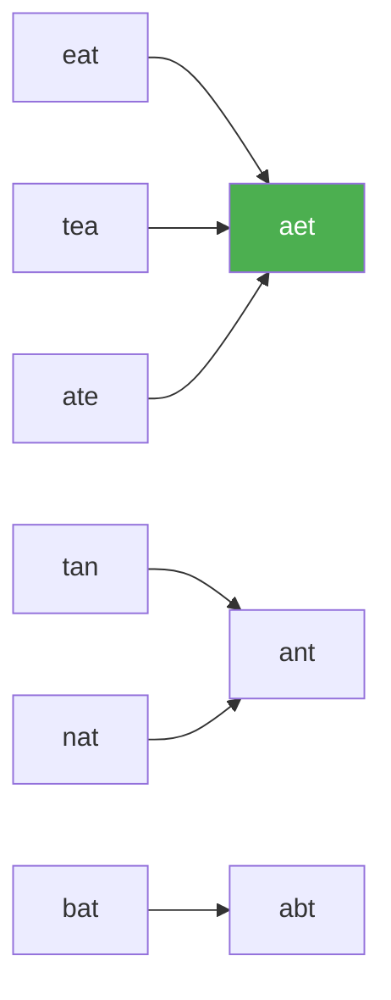

# 49. Group Anagrams

**Difficulty:** Medium
**Category:** Array, Hash Table, String, Sorting

## Problem

Given an array of strings `strs`, group the anagrams together. You can return the answer in any order.

### Example 1

```
Input: strs = ["eat","tea","tan","ate","nat","bat"]
Output: [["bat"],["nat","tan"],["ate","eat","tea"]]
```



### Example 2

```
Input: strs = [""]
Output: [[""]]
```

### Constraints

- `1 <= strs.length <= 10^4`
- `0 <= strs[i].length <= 100`
- `strs[i]` consists of lowercase English letters.

## Approach

Anagrams share the same characters when sorted, so sorting each string produces a canonical key. Group all original strings by this key using a dictionary, then return the grouped values.

## C# Solution

```csharp
public class Solution
{
    public IList<IList<string>> GroupAnagrams(string[] strs)
    {
        var groups = new Dictionary<string, List<string>>();

        foreach (var str in strs)
        {
            char[] chars = str.ToCharArray();
            Array.Sort(chars);
            string key = new string(chars);

            if (!groups.TryGetValue(key, out var group))
            {
                group = new List<string>();
                groups[key] = group;
            }

            group.Add(str);
        }

        return groups.Values.ToList<IList<string>>();
    }
}
```

## Complexity

- **Time:** `O(n * k log k)` — where `n` is the number of strings and `k` is the max string length (each string is sorted).
- **Space:** `O(n * k)` — for the grouping dictionary.
