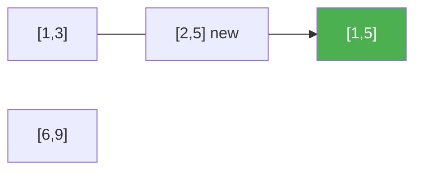

# 57. Insert Interval

**Difficulty:** Medium
**Category:** Array

## Problem

You are given an array of non-overlapping intervals `intervals` sorted by start time, and a new interval `newInterval`. Insert `newInterval` into `intervals` such that `intervals` is still sorted and non-overlapping (merging overlapping intervals as needed). Return the resulting array.

### Example 1

```
Input: intervals = [[1,3],[6,9]], newInterval = [2,5]
Output: [[1,5],[6,9]]
```



### Example 2

```
Input: intervals = [[1,2],[3,5],[6,7],[8,10],[12,16]], newInterval = [4,8]
Output: [[1,2],[3,10],[12,16]]
```

### Constraints

- `0 <= intervals.length <= 10^4`
- `intervals[i].length == 2`
- `0 <= starti <= endi <= 10^5`
- `intervals` is sorted by `starti` in ascending order.
- `newInterval.length == 2`
- `0 <= start <= end <= 10^5`

## Approach

Since `intervals` is already sorted and non-overlapping, do this in a single linear pass with three phases: (1) copy every interval that ends strictly before `newInterval` starts, (2) merge every interval that overlaps `newInterval` by expanding its bounds, then append the merged result, (3) copy every remaining interval that starts strictly after `newInterval` ends.

## C# Solution

```csharp
public class Solution
{
    public int[][] Insert(int[][] intervals, int[] newInterval)
    {
        var result = new List<int[]>();
        int i = 0, n = intervals.Length;

        while (i < n && intervals[i][1] < newInterval[0])
        {
            result.Add(intervals[i]);
            i++;
        }

        while (i < n && intervals[i][0] <= newInterval[1])
        {
            newInterval[0] = Math.Min(newInterval[0], intervals[i][0]);
            newInterval[1] = Math.Max(newInterval[1], intervals[i][1]);
            i++;
        }
        result.Add(newInterval);

        while (i < n)
        {
            result.Add(intervals[i]);
            i++;
        }

        return result.ToArray();
    }
}
```

## Complexity

- **Time:** `O(n)` — single pass over the input intervals.
- **Space:** `O(n)` — for the result array.
