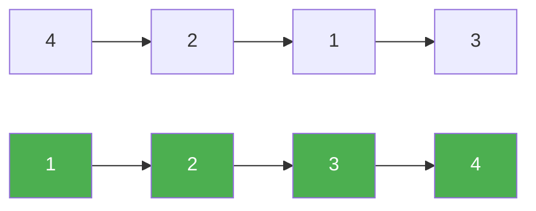

# 147. Insertion Sort List

**Difficulty:** Medium
**Category:** Linked List, Sorting

## Problem

Given the `head` of a singly linked list, sort the list using insertion sort, and return the sorted list's head.

### Example 1

```
Input: head = [4,2,1,3]
Output: [1,2,3,4]
```



### Example 2

```
Input: head = [-1,5,3,4,0]
Output: [-1,0,3,4,5]
```

### Constraints

- The number of nodes is in the range `[1, 5000]`.
- `-5000 <= Node.val <= 5000`

## Approach

Build a new sorted list one node at a time using a dummy head. For each node taken from the original list, scan the sorted portion (starting from the dummy) to find the correct insertion point, then splice the node in there.

## C# Solution

```csharp
public class Solution
{
    public ListNode InsertionSortList(ListNode head)
    {
        var dummy = new ListNode();

        while (head != null)
        {
            var next = head.next;
            var current = dummy;

            while (current.next != null && current.next.val < head.val)
            {
                current = current.next;
            }

            head.next = current.next;
            current.next = head;
            head = next;
        }

        return dummy.next;
    }
}
```

## Complexity

- **Time:** `O(n^2)` — worst case, each node scans the whole sorted portion.
- **Space:** `O(1)` — nodes are relinked in place.
