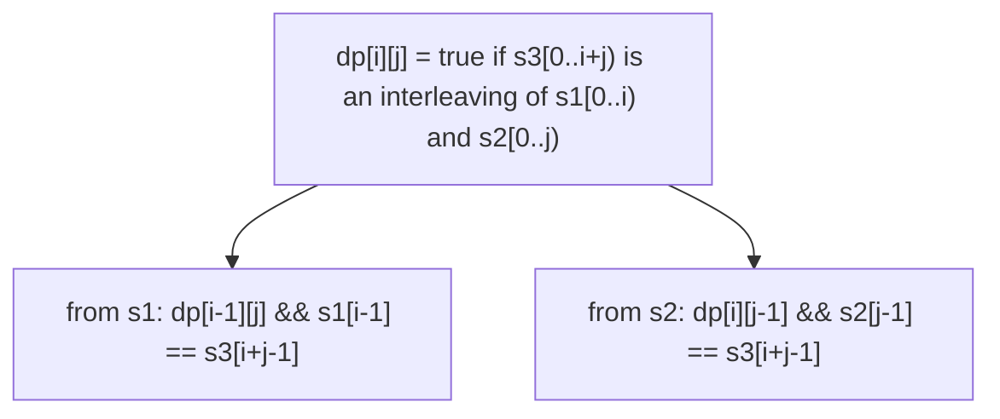

# 97. Interleaving String

**Difficulty:** Medium
**Category:** String, Dynamic Programming

## Problem

Given strings `s1`, `s2`, and `s3`, find whether `s3` is formed by an interleaving of `s1` and `s2` (characters of `s1` and `s2` are merged together, preserving each string's relative character order, but not necessarily contiguously).

### Example 1

```
Input: s1 = "aabcc", s2 = "dbbca", s3 = "aadbbcbcac"
Output: true
```



### Example 2

```
Input: s1 = "aabcc", s2 = "dbbca", s3 = "aadbbbaccc"
Output: false
```

### Constraints

- `0 <= s1.length, s2.length <= 100`
- `1 <= s3.length <= 200`
- `s1`, `s2`, and `s3` consist of lowercase English letters.

## Approach

`dp[i][j]` means the first `i + j` characters of `s3` can be formed by interleaving the first `i` characters of `s1` and the first `j` characters of `s2`. `dp[i][j]` is `true` if either the last character of `s3` came from `s1` (`dp[i-1][j]` is true and `s1[i-1] == s3[i+j-1]`) or from `s2` (`dp[i][j-1]` is true and `s2[j-1] == s3[i+j-1]`).

## C# Solution

```csharp
public class Solution
{
    public bool IsInterleave(string s1, string s2, string s3)
    {
        int m = s1.Length, n = s2.Length;
        if (m + n != s3.Length) return false;

        bool[,] dp = new bool[m + 1, n + 1];
        dp[0, 0] = true;

        for (int i = 1; i <= m; i++)
        {
            dp[i, 0] = dp[i - 1, 0] && s1[i - 1] == s3[i - 1];
        }

        for (int j = 1; j <= n; j++)
        {
            dp[0, j] = dp[0, j - 1] && s2[j - 1] == s3[j - 1];
        }

        for (int i = 1; i <= m; i++)
        {
            for (int j = 1; j <= n; j++)
            {
                bool fromS1 = dp[i - 1, j] && s1[i - 1] == s3[i + j - 1];
                bool fromS2 = dp[i, j - 1] && s2[j - 1] == s3[i + j - 1];
                dp[i, j] = fromS1 || fromS2;
            }
        }

        return dp[m, n];
    }
}
```

## Complexity

- **Time:** `O(m * n)` — fills the DP table once.
- **Space:** `O(m * n)` — for the DP table (reducible to `O(min(m, n))`).
