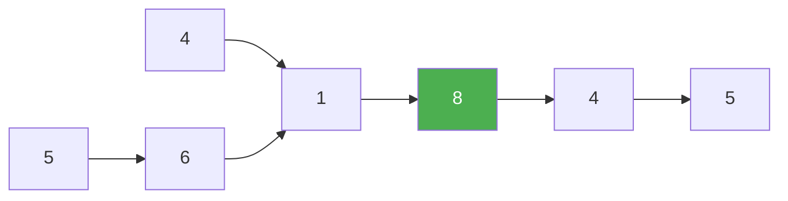

# 160. Intersection of Two Linked Lists

**Difficulty:** Easy
**Category:** Hash Table, Linked List, Two Pointers

## Problem

Given the heads of two singly linked lists, return the node at which the two lists intersect (share the same node reference onward), or `null` if they do not intersect.

### Example 1

```
Input: listA = [4,1,8,4,5], listB = [5,6,1,8,4,5], intersecting at node with value 8
Output: node with value 8
```



### Example 2

```
Input: listA = [2,6,4], listB = [1,5], no intersection
Output: null
```

### Constraints

- The number of nodes in both lists is in the range `[0, 3 * 10^4]`.
- `1 <= Node.val <= 10^5`

## Approach

Use two pointers, one starting at each list's head. When a pointer reaches the end of its list, redirect it to the head of the *other* list. Both pointers travel the same total distance (`lenA + lenB`) before meeting, so they arrive at the intersection node simultaneously — or both reach `null` at the same time if there's no intersection.

## C# Solution

```csharp
public class Solution
{
    public ListNode GetIntersectionNode(ListNode headA, ListNode headB)
    {
        if (headA == null || headB == null) return null;

        var pointerA = headA;
        var pointerB = headB;

        while (pointerA != pointerB)
        {
            pointerA = pointerA == null ? headB : pointerA.next;
            pointerB = pointerB == null ? headA : pointerB.next;
        }

        return pointerA;
    }
}
```

## Complexity

- **Time:** `O(m + n)` — each pointer traverses at most both lists once.
- **Space:** `O(1)`.
