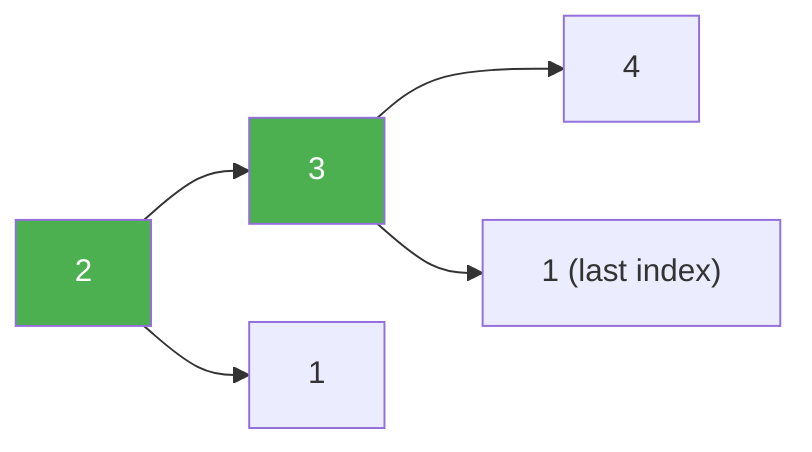

# 45. Jump Game II

**Difficulty:** Medium
**Category:** Array, Dynamic Programming, Greedy

## Problem

You are given a 0-indexed array of integers `nums` of length `n`. You are initially positioned at `nums[0]`. Each element `nums[i]` represents the maximum length of a forward jump from index `i`. Return the minimum number of jumps to reach `nums[n - 1]`. You can assume you can always reach it.

### Example 1

```
Input: nums = [2,3,1,1,4]
Output: 2
Explanation: Jump 1 step from index 0 to 1, then 3 steps to the last index.
```



### Example 2

```
Input: nums = [2,3,0,1,4]
Output: 2
```

### Constraints

- `1 <= nums.length <= 10^4`
- `0 <= nums[i] <= 1000`

## Approach

Greedy BFS-style level tracking: maintain the farthest index reachable with the current number of jumps (`currentEnd`) and the farthest index reachable with one more jump (`farthest`). Scan forward; whenever `i` reaches `currentEnd`, a new jump is required, so increment the jump count and advance `currentEnd` to `farthest`.

## C# Solution

```csharp
public class Solution
{
    public int Jump(int[] nums)
    {
        int jumps = 0, currentEnd = 0, farthest = 0;

        for (int i = 0; i < nums.Length - 1; i++)
        {
            farthest = Math.Max(farthest, i + nums[i]);

            if (i == currentEnd)
            {
                jumps++;
                currentEnd = farthest;
            }
        }

        return jumps;
    }
}
```

## Complexity

- **Time:** `O(n)` — single pass.
- **Space:** `O(1)`.
