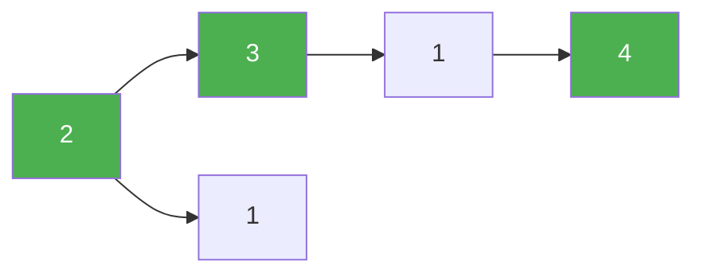

# 55. Jump Game

**Difficulty:** Medium
**Category:** Array, Dynamic Programming, Greedy

## Problem

You are given an integer array `nums`. You are initially positioned at the array's first index, and each element represents your maximum jump length at that position. Return `true` if you can reach the last index, or `false` otherwise.

### Example 1

```
Input: nums = [2,3,1,1,4]
Output: true
```



### Example 2

```
Input: nums = [3,2,1,0,4]
Output: false
Explanation: You will always arrive at index 3 no matter what, its maximum jump length is 0, so it's impossible to reach the last index.
```

### Constraints

- `1 <= nums.length <= 10^4`
- `0 <= nums[i] <= 10^5`

## Approach

Greedily track the farthest index reachable so far (`maxReach`). Scan left to right; if the current index ever exceeds `maxReach`, the end is unreachable. Otherwise keep extending `maxReach` with `i + nums[i]`.

## C# Solution

```csharp
public class Solution
{
    public bool CanJump(int[] nums)
    {
        int maxReach = 0;

        for (int i = 0; i < nums.Length; i++)
        {
            if (i > maxReach) return false;
            maxReach = Math.Max(maxReach, i + nums[i]);
        }

        return true;
    }
}
```

## Complexity

- **Time:** `O(n)` — single pass.
- **Space:** `O(1)`.
