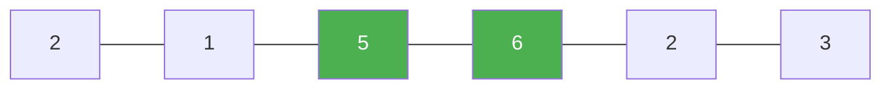

# 84. Largest Rectangle in Histogram

**Difficulty:** Hard
**Category:** Array, Stack, Monotonic Stack

## Problem

Given an array of integers `heights` representing the histogram's bar heights where the width of each bar is 1, return the area of the largest rectangle in the histogram.

### Example 1

```
Input: heights = [2,1,5,6,2,3]
Output: 10
Explanation: the largest rectangle has area 10, formed by bars of height 5 and 6 (width 2).
```



### Example 2

```
Input: heights = [2,4]
Output: 4
```

### Constraints

- `1 <= heights.length <= 10^5`
- `0 <= heights[i] <= 10^4`

## Approach

Maintain a monotonically increasing stack of bar indices. When the current bar is shorter than the bar at the top of the stack, that taller bar can't extend any further right, so pop it and compute the rectangle it forms (height = popped bar's height, width = current index minus the new stack top minus one). Process a sentinel `0` height at the end to flush any bars still on the stack.

## C# Solution

```csharp
public class Solution
{
    public int LargestRectangleArea(int[] heights)
    {
        var stack = new Stack<int>();
        int maxArea = 0;
        int n = heights.Length;

        for (int i = 0; i <= n; i++)
        {
            int currentHeight = (i == n) ? 0 : heights[i];

            while (stack.Count > 0 && heights[stack.Peek()] >= currentHeight)
            {
                int height = heights[stack.Pop()];
                int width = stack.Count == 0 ? i : i - stack.Peek() - 1;
                maxArea = Math.Max(maxArea, height * width);
            }

            stack.Push(i);
        }

        return maxArea;
    }
}
```

## Complexity

- **Time:** `O(n)` — each index is pushed and popped from the stack at most once.
- **Space:** `O(n)` — for the stack.
