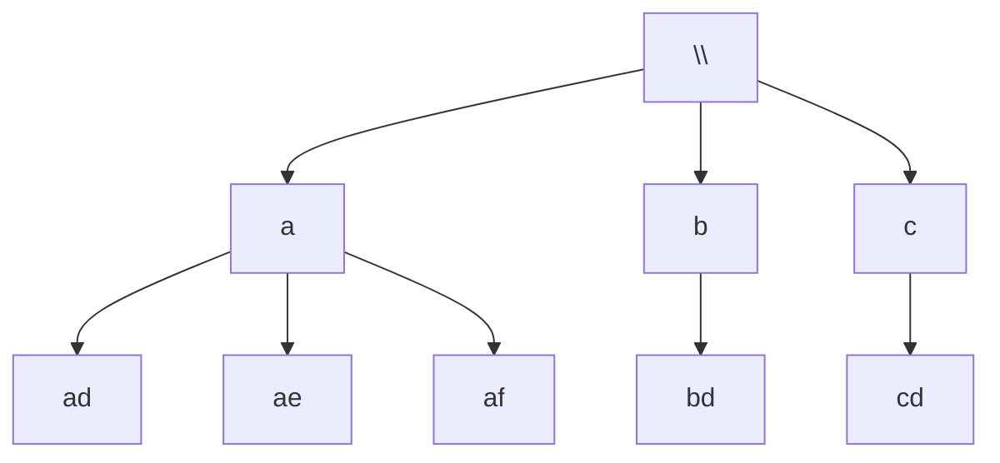

# 17. Letter Combinations of a Phone Number

**Difficulty:** Medium
**Category:** Hash Table, String, Backtracking

## Problem

Given a string containing digits from `2-9` inclusive, return all possible letter combinations that the number could represent (using the standard telephone keypad mapping). Return the answer in any order.

### Example 1

```
Input: digits = "23"
Output: ["ad","ae","af","bd","be","bf","cd","ce","cf"]
```



### Example 2

```
Input: digits = ""
Output: []
```

### Example 3

```
Input: digits = "2"
Output: ["a","b","c"]
```

### Constraints

- `0 <= digits.length <= 4`
- `digits[i]` is a digit in the range `['2', '9']`.

## Approach

Backtrack digit by digit: for the current digit, try each letter it maps to, append it to the running combination, recurse into the next digit, then remove it (backtrack) before trying the next letter.

## C# Solution

```csharp
public class Solution
{
    private static readonly Dictionary<char, string> KeypadMap = new()
    {
        ['2'] = "abc", ['3'] = "def", ['4'] = "ghi", ['5'] = "jkl",
        ['6'] = "mno", ['7'] = "pqrs", ['8'] = "tuv", ['9'] = "wxyz",
    };

    public IList<string> LetterCombinations(string digits)
    {
        var result = new List<string>();
        if (string.IsNullOrEmpty(digits)) return result;

        Backtrack(digits, 0, new StringBuilder(), result);
        return result;
    }

    private void Backtrack(string digits, int index, StringBuilder current, List<string> result)
    {
        if (index == digits.Length)
        {
            result.Add(current.ToString());
            return;
        }

        foreach (char letter in KeypadMap[digits[index]])
        {
            current.Append(letter);
            Backtrack(digits, index + 1, current, result);
            current.Length--;
        }
    }
}
```

## Complexity

- **Time:** `O(4^n * n)` — up to 4 letters per digit (digit 7 and 9), `n` digits, plus building each string of length `n`.
- **Space:** `O(n)` for the recursion depth, excluding the output.
