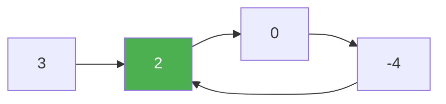

# 142. Linked List Cycle II

**Difficulty:** Medium
**Category:** Hash Table, Linked List, Two Pointers

## Problem

Given the `head` of a linked list, return the node where the cycle begins, or `null` if there is no cycle.

### Example 1

```
Input: head = [3,2,0,-4], cycle back to index 1
Output: node with value 2
```



### Example 2

```
Input: head = [1], no cycle
Output: null
```

### Constraints

- The number of nodes is in the range `[0, 10^4]`.
- `-10^5 <= Node.val <= 10^5`

## Approach

Use Floyd's algorithm in two phases. Phase one: advance `slow` by one and `fast` by two until they meet (if `fast` reaches `null`, there's no cycle). Phase two: reset one pointer to `head` and advance both pointers one step at a time — they are mathematically guaranteed to meet exactly at the cycle's start, because the distance from `head` to the cycle start equals the distance from the meeting point to the cycle start (going forward around the loop).

## C# Solution

```csharp
public class Solution
{
    public ListNode DetectCycle(ListNode head)
    {
        var slow = head;
        var fast = head;

        while (fast != null && fast.next != null)
        {
            slow = slow.next;
            fast = fast.next.next;

            if (slow == fast)
            {
                var pointer = head;
                while (pointer != slow)
                {
                    pointer = pointer.next;
                    slow = slow.next;
                }
                return pointer;
            }
        }

        return null;
    }
}
```

## Complexity

- **Time:** `O(n)` — bounded number of traversals.
- **Space:** `O(1)`.
