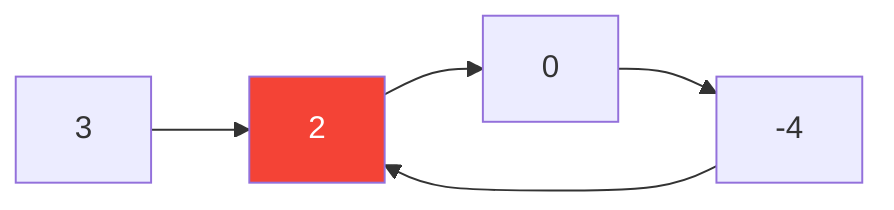

# 141. Linked List Cycle

**Difficulty:** Easy
**Category:** Hash Table, Linked List, Two Pointers

## Problem

Given the `head` of a linked list, determine if the list has a cycle in it (a node's `next` pointer eventually leads back to a previously visited node).

### Example 1

```
Input: head = [3,2,0,-4], with a cycle back to index 1
Output: true
```



### Example 2

```
Input: head = [1], no cycle
Output: false
```

### Constraints

- The number of nodes is in the range `[0, 10^4]`.
- `-10^5 <= Node.val <= 10^5`

## Approach

Floyd's cycle detection (the "tortoise and hare" technique): advance a `slow` pointer one step and a `fast` pointer two steps at a time. If there's a cycle, `fast` will eventually lap `slow` and they'll meet inside the loop; if `fast` reaches the end (`null`), there's no cycle.

## C# Solution

```csharp
public class Solution
{
    public bool HasCycle(ListNode head)
    {
        var slow = head;
        var fast = head;

        while (fast != null && fast.next != null)
        {
            slow = slow.next;
            fast = fast.next.next;

            if (slow == fast) return true;
        }

        return false;
    }
}
```

## Complexity

- **Time:** `O(n)` — `fast` traverses the list at most twice.
- **Space:** `O(1)`.
