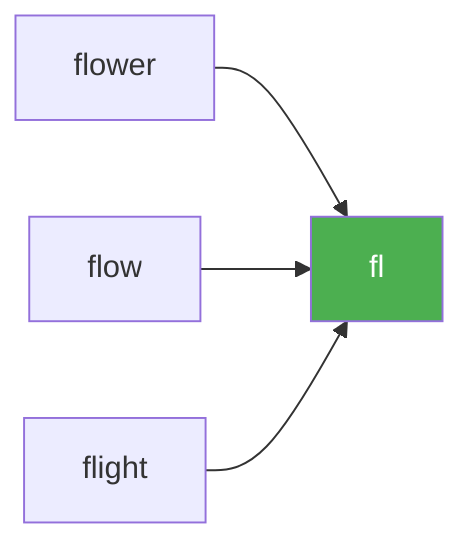

# 14. Longest Common Prefix

**Difficulty:** Easy
**Category:** String, Trie

## Problem

Write a function to find the longest common prefix string amongst an array of strings.

If there is no common prefix, return an empty string `""`.

### Example 1

```
Input: strs = ["flower","flow","flight"]
Output: "fl"
```



### Example 2

```
Input: strs = ["dog","racecar","car"]
Output: ""
Explanation: There is no common prefix among the input strings.
```

### Constraints

- `1 <= strs.length <= 200`
- `0 <= strs[i].length <= 200`
- `strs[i]` consists of only lowercase English letters (if it is non-empty).

## Approach

Treat the first string as a candidate prefix, then shrink it (from the end) every time it fails to match the start of another string in the array. Once the candidate is empty, no common prefix exists.

## C# Solution

```csharp
public class Solution
{
    public string LongestCommonPrefix(string[] strs)
    {
        if (strs.Length == 0) return string.Empty;

        string prefix = strs[0];

        for (int i = 1; i < strs.Length; i++)
        {
            while (!strs[i].StartsWith(prefix, StringComparison.Ordinal))
            {
                prefix = prefix.Substring(0, prefix.Length - 1);
                if (prefix.Length == 0) return string.Empty;
            }
        }

        return prefix;
    }
}
```

## Complexity

- **Time:** `O(S)` — where `S` is the sum of all characters across the input strings, in the worst case.
- **Space:** `O(1)` — excluding the output prefix.
