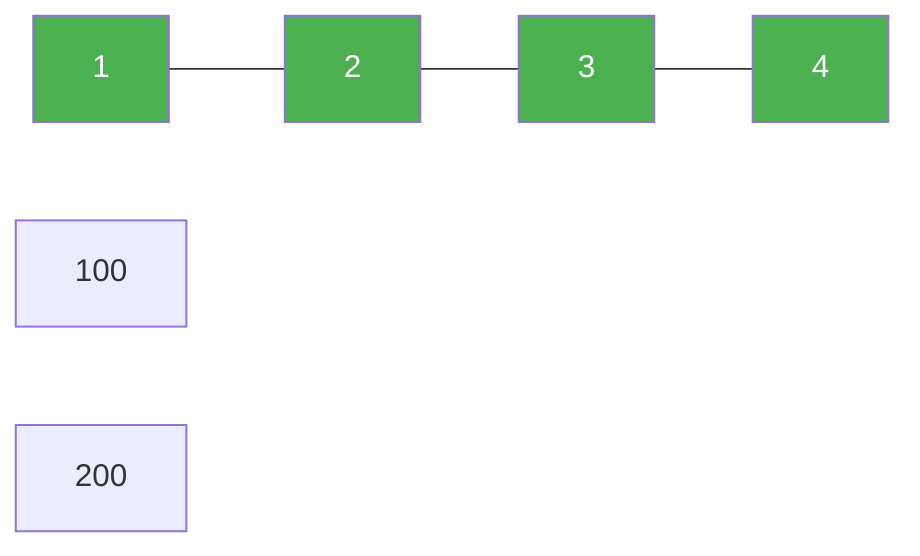

# 128. Longest Consecutive Sequence

**Difficulty:** Medium
**Category:** Array, Hash Table, Union Find

## Problem

Given an unsorted array of integers `nums`, return the length of the longest consecutive elements sequence (a run of consecutive integers, not necessarily contiguous in the array). You must write an algorithm that runs in `O(n)` time.

### Example 1

```
Input: nums = [100,4,200,1,3,2]
Output: 4
Explanation: The longest consecutive sequence is [1, 2, 3, 4].
```



### Example 2

```
Input: nums = [0,3,7,2,5,8,4,6,0,1]
Output: 9
```

### Constraints

- `0 <= nums.length <= 10^5`
- `-10^9 <= nums[i] <= 10^9`

## Approach

Put all values in a hash set for `O(1)` lookups. Only start counting a sequence from a number that is the **start** of a run (i.e., `num - 1` is not in the set) — this guarantees every run is only ever counted once, from its smallest member, keeping the overall work linear even though there's a nested `while` loop.

## C# Solution

```csharp
public class Solution
{
    public int LongestConsecutive(int[] nums)
    {
        var numSet = new HashSet<int>(nums);
        int longest = 0;

        foreach (int num in numSet)
        {
            if (numSet.Contains(num - 1)) continue; // not a sequence start

            int length = 1;
            int current = num;

            while (numSet.Contains(current + 1))
            {
                current++;
                length++;
            }

            longest = Math.Max(longest, length);
        }

        return longest;
    }
}
```

## Complexity

- **Time:** `O(n)` — each number is visited by the inner `while` loop at most once across the whole run.
- **Space:** `O(n)` — for the hash set.
