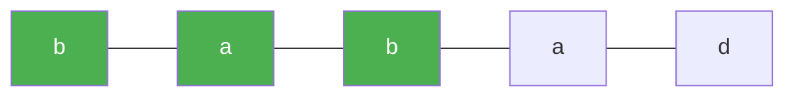

# 5. Longest Palindromic Substring

**Difficulty:** Medium
**Category:** String, Dynamic Programming

## Problem

Given a string `s`, return the longest palindromic substring in `s`.

### Example 1

```
Input: s = "babad"
Output: "bab"
Explanation: "aba" is also a valid answer.
```



### Example 2

```
Input: s = "cbbd"
Output: "bb"
```

### Constraints

- `1 <= s.length <= 1000`
- `s` consist of only digits and English letters.

## Approach

For every index, expand outward in both directions treating the index as the center of an odd-length palindrome, and the gap between it and the next index as the center of an even-length palindrome. Track the widest palindrome found across all centers.

## C# Solution

```csharp
public class Solution
{
    public string LongestPalindrome(string s)
    {
        if (string.IsNullOrEmpty(s)) return string.Empty;

        int start = 0, maxLen = 1;

        for (int center = 0; center < s.Length; center++)
        {
            int oddLen = ExpandFromCenter(s, center, center);
            int evenLen = ExpandFromCenter(s, center, center + 1);
            int len = Math.Max(oddLen, evenLen);

            if (len > maxLen)
            {
                maxLen = len;
                start = center - (len - 1) / 2;
            }
        }

        return s.Substring(start, maxLen);
    }

    private int ExpandFromCenter(string s, int left, int right)
    {
        while (left >= 0 && right < s.Length && s[left] == s[right])
        {
            left--;
            right++;
        }

        return right - left - 1;
    }
}
```

## Complexity

- **Time:** `O(n^2)` — up to `n` centers, each expansion up to `O(n)`.
- **Space:** `O(1)` — only a few index variables are tracked.
