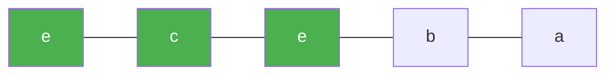

# 159. Longest Substring with At Most Two Distinct Characters

**Difficulty:** Medium
**Category:** Hash Table, String, Sliding Window

## Problem

Given a string `s`, return the length of the longest substring that contains at most two distinct characters.

### Example 1

```
Input: s = "eceba"
Output: 3
Explanation: substring "ece" has length 3 with 2 distinct characters ('e' and 'c').
```



### Example 2

```
Input: s = "ccaabbb"
Output: 5
```

### Constraints

- `1 <= s.length <= 10^5`
- `s` consists of English letters.

## Approach

Sliding window with a dictionary tracking the count of each character in the current window. Expand `right` each step; whenever the window holds more than two distinct characters, shrink from `left` (decrementing counts and removing entries that hit zero) until only two distinct characters remain. Track the widest valid window seen.

## C# Solution

```csharp
public class Solution
{
    public int LengthOfLongestSubstringTwoDistinct(string s)
    {
        var counts = new Dictionary<char, int>();
        int left = 0, maxLen = 0;

        for (int right = 0; right < s.Length; right++)
        {
            char c = s[right];
            counts[c] = counts.GetValueOrDefault(c) + 1;

            while (counts.Count > 2)
            {
                char leftChar = s[left];
                counts[leftChar]--;
                if (counts[leftChar] == 0) counts.Remove(leftChar);
                left++;
            }

            maxLen = Math.Max(maxLen, right - left + 1);
        }

        return maxLen;
    }
}
```

## Complexity

- **Time:** `O(n)` — each character is visited by `left` and `right` at most once.
- **Space:** `O(1)` — the dictionary holds at most 3 entries at any time.
