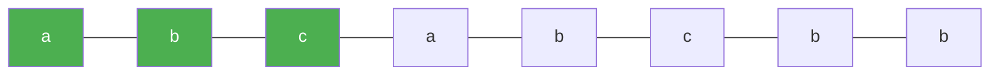

# 3. Longest Substring Without Repeating Characters

**Difficulty:** Medium
**Category:** Hash Table, String, Sliding Window

## Problem

Given a string `s`, find the length of the longest substring without duplicate characters.

### Example 1

```
Input: s = "abcabcbb"
Output: 3
Explanation: The answer is "abc", with the length of 3.
```



### Example 2

```
Input: s = "bbbbb"
Output: 1
Explanation: The answer is "b", with the length of 1.
```

### Example 3

```
Input: s = "pwwkew"
Output: 3
Explanation: The answer is "wke", with the length of 3. Notice that the answer must be a substring, "pwke" is a subsequence and not a substring.
```

### Constraints

- `0 <= s.length <= 10^5`
- `s` consists of English letters, digits, symbols and spaces.

## Approach

Use a sliding window `[start, end]` and a dictionary that maps each character to the index it was last seen at. When a repeat is found inside the current window, jump `start` past the previous occurrence instead of resetting the window, keeping the scan linear.

## C# Solution

```csharp
public class Solution
{
    public int LengthOfLongestSubstring(string s)
    {
        var lastIndex = new Dictionary<char, int>();
        int start = 0, maxLen = 0;

        for (int end = 0; end < s.Length; end++)
        {
            char c = s[end];
            if (lastIndex.TryGetValue(c, out int idx) && idx >= start)
            {
                start = idx + 1;
            }

            lastIndex[c] = end;
            maxLen = Math.Max(maxLen, end - start + 1);
        }

        return maxLen;
    }
}
```

## Complexity

- **Time:** `O(n)` — each character is visited once by `end` and `start` only moves forward.
- **Space:** `O(min(n, charset size))` — for the last-seen-index dictionary.
