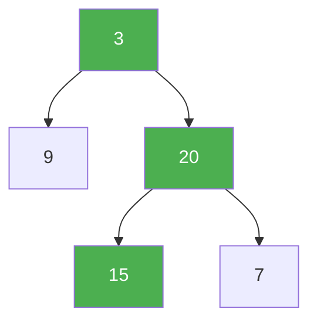

# 104. Maximum Depth of Binary Tree

**Difficulty:** Easy
**Category:** Tree, Depth-First Search, Breadth-First Search, Binary Tree

## Problem

Given the `root` of a binary tree, return its maximum depth — the number of nodes along the longest path from the root down to the farthest leaf node.

### Example 1

```
Input: root = [3,9,20,null,null,15,7]
Output: 3
```



### Example 2

```
Input: root = [1,null,2]
Output: 2
```

### Constraints

- The number of nodes in the tree is in the range `[0, 10^4]`.
- `-100 <= Node.val <= 100`

## Approach

The depth of a tree is `1 +` the larger of its two subtrees' depths (an empty tree has depth `0`). This maps directly onto a simple post-order recursion.

## C# Solution

```csharp
public class Solution
{
    public int MaxDepth(TreeNode root)
    {
        if (root == null) return 0;
        return 1 + Math.Max(MaxDepth(root.left), MaxDepth(root.right));
    }
}
```

## Complexity

- **Time:** `O(n)` — every node is visited once.
- **Space:** `O(h)` — recursion depth equal to the tree height.
