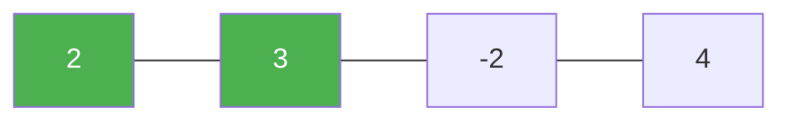

# 152. Maximum Product Subarray

**Difficulty:** Medium
**Category:** Array, Dynamic Programming

## Problem

Given an integer array `nums`, find a contiguous non-empty subarray that has the largest product, and return the product.

### Example 1

```
Input: nums = [2,3,-2,4]
Output: 6
Explanation: [2,3] has the largest product 6.
```



### Example 2

```
Input: nums = [-2,0,-1]
Output: 0
```

### Constraints

- `1 <= nums.length <= 2 * 10^4`
- `-10 <= nums[i] <= 10`

## Approach

Unlike Maximum Subarray, a negative number can flip the largest product into the smallest (and vice versa), so track both a running `maxProduct` and `minProduct` ending at each position. At each step, consider extending the previous max/min or restarting at the current element; swap `maxProduct` and `minProduct` first whenever the current number is negative, since multiplying by a negative flips their relative order.

## C# Solution

```csharp
public class Solution
{
    public int MaxProduct(int[] nums)
    {
        int maxProduct = nums[0], minProduct = nums[0], result = nums[0];

        for (int i = 1; i < nums.Length; i++)
        {
            int num = nums[i];

            if (num < 0)
            {
                (maxProduct, minProduct) = (minProduct, maxProduct);
            }

            maxProduct = Math.Max(num, maxProduct * num);
            minProduct = Math.Min(num, minProduct * num);

            result = Math.Max(result, maxProduct);
        }

        return result;
    }
}
```

## Complexity

- **Time:** `O(n)` — single pass.
- **Space:** `O(1)`.
