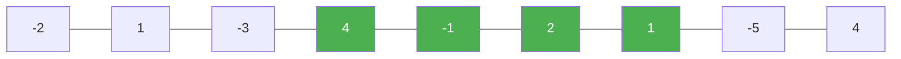

# 53. Maximum Subarray

**Difficulty:** Medium
**Category:** Array, Divide and Conquer, Dynamic Programming

## Problem

Given an integer array `nums`, find the subarray with the largest sum, and return its sum.

### Example 1

```
Input: nums = [-2,1,-3,4,-1,2,1,-5,4]
Output: 6
Explanation: The subarray [4,-1,2,1] has the largest sum 6.
```



### Example 2

```
Input: nums = [1]
Output: 1
```

### Constraints

- `1 <= nums.length <= 10^5`
- `-10^4 <= nums[i] <= 10^4`

## Approach

This is Kadane's algorithm: track `currentSum`, the best sum of a subarray ending exactly at the current index. At each step, either extend the previous subarray or start fresh at the current element, whichever is larger (`Math.Max(nums[i], currentSum + nums[i])`). Track the overall best across all positions.

## C# Solution

```csharp
public class Solution
{
    public int MaxSubArray(int[] nums)
    {
        int currentSum = nums[0];
        int maxSum = nums[0];

        for (int i = 1; i < nums.Length; i++)
        {
            currentSum = Math.Max(nums[i], currentSum + nums[i]);
            maxSum = Math.Max(maxSum, currentSum);
        }

        return maxSum;
    }
}
```

## Complexity

- **Time:** `O(n)` — single pass.
- **Space:** `O(1)`.
