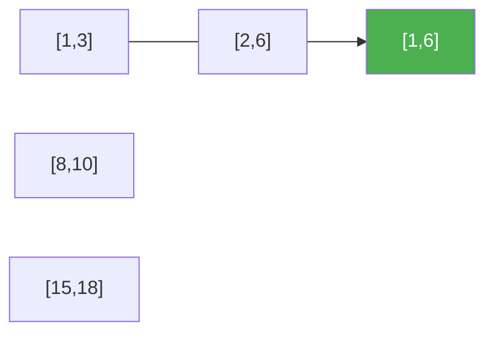

# 56. Merge Intervals

**Difficulty:** Medium
**Category:** Array, Sorting

## Problem

Given an array of `intervals` where `intervals[i] = [starti, endi]`, merge all overlapping intervals, and return an array of the non-overlapping intervals that cover all the intervals in the input.

### Example 1

```
Input: intervals = [[1,3],[2,6],[8,10],[15,18]]
Output: [[1,6],[8,10],[15,18]]
Explanation: Since intervals [1,3] and [2,6] overlap, merge them into [1,6].
```



### Example 2

```
Input: intervals = [[1,4],[4,5]]
Output: [[1,5]]
```

### Constraints

- `1 <= intervals.length <= 10^4`
- `intervals[i].length == 2`
- `0 <= starti <= endi <= 10^4`

## Approach

Sort intervals by start time. Walk through them, keeping a "current merged interval" — if the next interval's start is `<=` the current merged interval's end, they overlap, so extend the end; otherwise close off the current merged interval and start a new one.

## C# Solution

```csharp
public class Solution
{
    public int[][] Merge(int[][] intervals)
    {
        Array.Sort(intervals, (a, b) => a[0].CompareTo(b[0]));

        var result = new List<int[]>();

        foreach (var interval in intervals)
        {
            if (result.Count == 0 || result[^1][1] < interval[0])
            {
                result.Add(interval);
            }
            else
            {
                result[^1][1] = Math.Max(result[^1][1], interval[1]);
            }
        }

        return result.ToArray();
    }
}
```

## Complexity

- **Time:** `O(n log n)` — dominated by sorting.
- **Space:** `O(n)` — for the result list (or `O(log n)` extra if the sort is in-place, excluding output).
