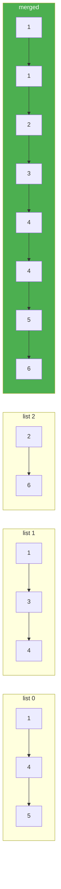

# 23. Merge k Sorted Lists

**Difficulty:** Hard
**Category:** Linked List, Divide and Conquer, Heap (Priority Queue)

## Problem

You are given an array of `k` linked-lists `lists`, each linked-list is sorted in ascending order. Merge all the linked-lists into one sorted linked-list and return it.

### Example 1

```
Input: lists = [[1,4,5],[1,3,4],[2,6]]
Output: [1,1,2,3,4,4,5,6]
```



### Example 2

```
Input: lists = []
Output: []
```

### Example 3

```
Input: lists = [[]]
Output: []
```

### Constraints

- `k == lists.length`
- `0 <= k <= 10^4`
- `0 <= lists[i].length <= 500`
- `-10^4 <= lists[i][j] <= 10^4`
- `lists[i]` is sorted in ascending order.
- The sum of `lists[i].length` will not exceed `10^4`.

## Approach

Use a min-heap (`PriorityQueue<ListNode, int>` in .NET) seeded with the head of every list. Repeatedly pop the smallest node, append it to the result, and if that node has a `next`, push it back onto the heap. This avoids comparing all `k` lists pairwise on every step.

## C# Solution

```csharp
public class Solution
{
    public ListNode MergeKLists(ListNode[] lists)
    {
        var heap = new PriorityQueue<ListNode, int>();

        foreach (var node in lists)
        {
            if (node != null) heap.Enqueue(node, node.val);
        }

        var dummy = new ListNode();
        var current = dummy;

        while (heap.Count > 0)
        {
            var node = heap.Dequeue();
            current.next = node;
            current = current.next;

            if (node.next != null)
            {
                heap.Enqueue(node.next, node.next.val);
            }
        }

        return dummy.next;
    }
}
```

## Complexity

- **Time:** `O(N log k)` — where `N` is the total number of nodes and `k` is the number of lists; each of the `N` heap operations costs `O(log k)`.
- **Space:** `O(k)` — the heap holds at most one node per list at a time.
