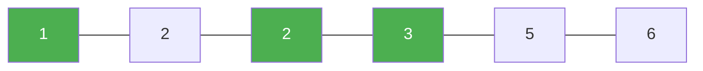

# 88. Merge Sorted Array

**Difficulty:** Easy
**Category:** Array, Two Pointers, Sorting

## Problem

You are given two integer arrays `nums1` and `nums2`, sorted in non-decreasing order, and two integers `m` and `n`, representing the number of elements in `nums1` and `nums2` respectively. `nums1` has a length of `m + n`, with the last `n` elements set to `0` to be overwritten. Merge `nums2` into `nums1` as one sorted array, in place.

### Example 1

```
Input: nums1 = [1,2,3,0,0,0], m = 3, nums2 = [2,5,6], n = 3
Output: [1,2,2,3,5,6]
```



### Example 2

```
Input: nums1 = [1], m = 1, nums2 = [], n = 0
Output: [1]
```

### Constraints

- `nums1.length == m + n`
- `nums2.length == n`
- `0 <= m, n <= 200`
- `1 <= m + n <= 200`

## Approach

Merge from the back rather than the front, to avoid overwriting unprocessed elements of `nums1`. Compare the largest remaining unplaced elements of both arrays and place the larger one at the current end of `nums1`, working backward. Any remaining `nums2` elements are copied directly (remaining `nums1` elements are already in place).

## C# Solution

```csharp
public class Solution
{
    public void Merge(int[] nums1, int m, int[] nums2, int n)
    {
        int i = m - 1, j = n - 1, write = m + n - 1;

        while (j >= 0)
        {
            if (i >= 0 && nums1[i] > nums2[j])
            {
                nums1[write--] = nums1[i--];
            }
            else
            {
                nums1[write--] = nums2[j--];
            }
        }
    }
}
```

## Complexity

- **Time:** `O(m + n)` — single backward pass.
- **Space:** `O(1)` — in-place.
