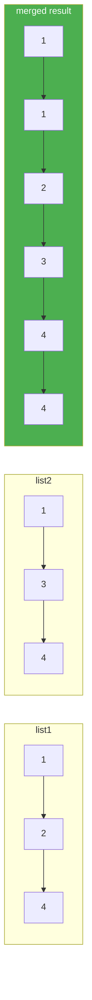

# 21. Merge Two Sorted Lists

**Difficulty:** Easy
**Category:** Linked List, Recursion

## Problem

You are given the heads of two sorted linked lists `list1` and `list2`. Merge the two lists into one sorted list by splicing together the nodes of the first two lists, and return the head of the merged list.

### Example 1

```
Input: list1 = [1,2,4], list2 = [1,3,4]
Output: [1,1,2,3,4,4]
```



### Example 2

```
Input: list1 = [], list2 = []
Output: []
```

### Example 3

```
Input: list1 = [], list2 = [0]
Output: [0]
```

### Constraints

- The number of nodes in both lists is in the range `[0, 50]`.
- `-100 <= Node.val <= 100`
- Both `list1` and `list2` are sorted in non-decreasing order.

## Approach

Walk both lists simultaneously with a dummy head, always attaching the smaller of the two current nodes to the merged list and advancing that list's pointer. Once one list is exhausted, attach the remainder of the other list directly.

## C# Solution

```csharp
public class Solution
{
    public ListNode MergeTwoLists(ListNode list1, ListNode list2)
    {
        var dummy = new ListNode();
        var current = dummy;

        while (list1 != null && list2 != null)
        {
            if (list1.val <= list2.val)
            {
                current.next = list1;
                list1 = list1.next;
            }
            else
            {
                current.next = list2;
                list2 = list2.next;
            }

            current = current.next;
        }

        current.next = list1 ?? list2;
        return dummy.next;
    }
}
```

## Complexity

- **Time:** `O(m + n)` — one pass over both lists combined.
- **Space:** `O(1)` — nodes are relinked in place, no new nodes are allocated.
