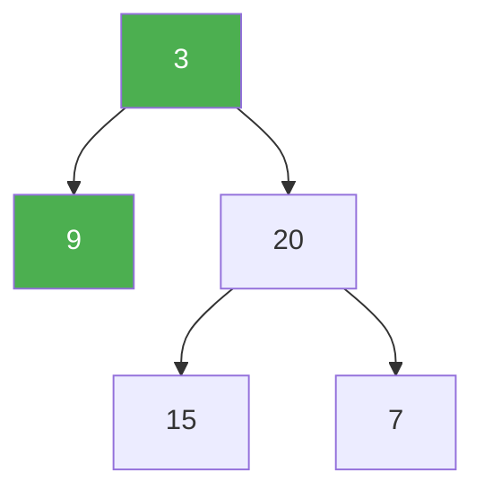

# 111. Minimum Depth of Binary Tree

**Difficulty:** Easy
**Category:** Tree, Depth-First Search, Breadth-First Search, Binary Tree

## Problem

Given a binary tree, find its minimum depth — the number of nodes along the shortest path from the root down to the nearest leaf node (a leaf has no children).

### Example 1

```
Input: root = [3,9,20,null,null,15,7]
Output: 2
```



### Example 2

```
Input: root = [2,null,3,null,4,null,5,null,6]
Output: 5
```

### Constraints

- The number of nodes in the tree is in the range `[0, 10^5]`.
- `-1000 <= Node.val <= 1000`

## Approach

A common bug is treating this exactly like maximum depth (`1 + min(left, right)`), which breaks when one child is missing — an empty subtree isn't a shorter path, it's simply not a leaf. If a node has only one child, the minimum depth must come from that existing child; only when both children exist (or both are absent) is the plain min/max recursion correct.

## C# Solution

```csharp
public class Solution
{
    public int MinDepth(TreeNode root)
    {
        if (root == null) return 0;

        if (root.left == null) return 1 + MinDepth(root.right);
        if (root.right == null) return 1 + MinDepth(root.left);

        return 1 + Math.Min(MinDepth(root.left), MinDepth(root.right));
    }
}
```

## Complexity

- **Time:** `O(n)` — every node is visited once.
- **Space:** `O(h)` — recursion depth equal to the tree height.
