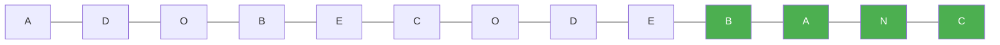

# 76. Minimum Window Substring

**Difficulty:** Hard
**Category:** Hash Table, String, Sliding Window

## Problem

Given two strings `s` and `t`, return the minimum window substring of `s` such that every character in `t` (including duplicates) is included in the window. If there is no such substring, return the empty string.

### Example 1

```
Input: s = "ADOBECODEBANC", t = "ABC"
Output: "BANC"
Explanation: The minimum window substring "BANC" includes 'A', 'B', and 'C' from string t.
```



### Example 2

```
Input: s = "a", t = "a"
Output: "a"
```

### Constraints

- `1 <= s.length, t.length <= 10^5`
- `s` and `t` consist of uppercase and lowercase English letters.

## Approach

Use a sliding window with two dictionaries (or one dictionary and a counter): expand `right` to include characters until the window contains all of `t`'s required characters, then shrink `left` as much as possible while still satisfying the requirement, tracking the smallest valid window seen. A running `formed` counter (how many unique required characters currently meet their required count) avoids re-checking the whole dictionary on every step.

## C# Solution

```csharp
public class Solution
{
    public string MinWindow(string s, string t)
    {
        if (s.Length == 0 || t.Length == 0) return string.Empty;

        var required = new Dictionary<char, int>();
        foreach (char c in t) required[c] = required.GetValueOrDefault(c) + 1;

        int requiredCount = required.Count;
        var windowCounts = new Dictionary<char, int>();
        int formed = 0;

        int left = 0, bestLen = int.MaxValue, bestStart = 0;

        for (int right = 0; right < s.Length; right++)
        {
            char c = s[right];
            windowCounts[c] = windowCounts.GetValueOrDefault(c) + 1;

            if (required.TryGetValue(c, out int need) && windowCounts[c] == need)
            {
                formed++;
            }

            while (formed == requiredCount)
            {
                if (right - left + 1 < bestLen)
                {
                    bestLen = right - left + 1;
                    bestStart = left;
                }

                char leftChar = s[left];
                windowCounts[leftChar]--;

                if (required.TryGetValue(leftChar, out int leftNeed) && windowCounts[leftChar] < leftNeed)
                {
                    formed--;
                }

                left++;
            }
        }

        return bestLen == int.MaxValue ? string.Empty : s.Substring(bestStart, bestLen);
    }
}
```

## Complexity

- **Time:** `O(|s| + |t|)` — each character in `s` is visited by `left` and `right` at most once.
- **Space:** `O(|s| + |t|)` — for the dictionaries.
