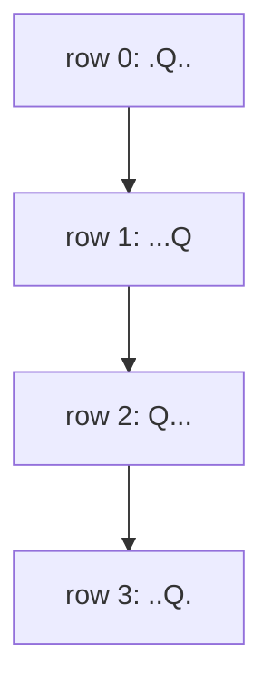

# 51. N-Queens

**Difficulty:** Hard
**Category:** Array, Backtracking

## Problem

The n-queens puzzle is the problem of placing `n` chess queens on an `n x n` chessboard such that no two queens attack each other. Given an integer `n`, return all distinct solutions to the n-queens puzzle, with each solution represented as a board where `'Q'` and `'.'` indicate a queen and an empty space, respectively.

### Example 1

```
Input: n = 4
Output: [[".Q..","...Q","Q...","..Q."],["..Q.","Q...","...Q",".Q.."]]
```



### Example 2

```
Input: n = 1
Output: [["Q"]]
```

### Constraints

- `1 <= n <= 9`

## Approach

Place queens row by row. For each row, try every column, checking whether it conflicts with a queen already placed in an earlier row (same column, or same diagonal — tracked with `col`, `diag = row - col`, and `antiDiag = row + col` sets for `O(1)` conflict checks). If no conflict, place the queen and recurse to the next row; otherwise backtrack.

## C# Solution

```csharp
public class Solution
{
    public IList<IList<string>> SolveNQueens(int n)
    {
        var result = new List<IList<string>>();
        var cols = new HashSet<int>();
        var diagonals = new HashSet<int>();
        var antiDiagonals = new HashSet<int>();
        var queenCol = new int[n];

        Backtrack(0, n, cols, diagonals, antiDiagonals, queenCol, result);
        return result;
    }

    private void Backtrack(int row, int n, HashSet<int> cols, HashSet<int> diagonals,
        HashSet<int> antiDiagonals, int[] queenCol, List<IList<string>> result)
    {
        if (row == n)
        {
            result.Add(BuildBoard(queenCol, n));
            return;
        }

        for (int col = 0; col < n; col++)
        {
            int diag = row - col, antiDiag = row + col;
            if (cols.Contains(col) || diagonals.Contains(diag) || antiDiagonals.Contains(antiDiag)) continue;

            cols.Add(col);
            diagonals.Add(diag);
            antiDiagonals.Add(antiDiag);
            queenCol[row] = col;

            Backtrack(row + 1, n, cols, diagonals, antiDiagonals, queenCol, result);

            cols.Remove(col);
            diagonals.Remove(diag);
            antiDiagonals.Remove(antiDiag);
        }
    }

    private List<string> BuildBoard(int[] queenCol, int n)
    {
        var board = new List<string>(n);
        for (int row = 0; row < n; row++)
        {
            var chars = new char[n];
            Array.Fill(chars, '.');
            chars[queenCol[row]] = 'Q';
            board.Add(new string(chars));
        }
        return board;
    }
}
```

## Complexity

- **Time:** `O(n!)` worst case — backtracking search space, pruned heavily by the constant-time conflict sets.
- **Space:** `O(n)` — for the tracking sets and recursion depth, excluding the output.
