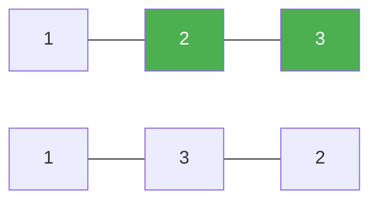

# 31. Next Permutation

**Difficulty:** Medium
**Category:** Array, Two Pointers

## Problem

Given an array of integers `nums`, find the next permutation of `nums` — the lexicographically next greater permutation of its integers. If no such permutation exists (the array is sorted in descending order), rearrange it as the lowest possible order (sorted ascending). The replacement must be in-place, using only constant extra memory.

### Example 1

```
Input: nums = [1,2,3]
Output: [1,3,2]
```



### Example 2

```
Input: nums = [3,2,1]
Output: [1,2,3]
```

### Example 3

```
Input: nums = [1,1,5]
Output: [1,5,1]
```

### Constraints

- `1 <= nums.length <= 100`
- `0 <= nums[i] <= 100`

## Approach

Scan from the right to find the first index `i` where `nums[i] < nums[i + 1]` (the "pivot"). If found, scan from the right again to find the first index `j > i` with `nums[j] > nums[i]`, swap them, then reverse the suffix after `i` to make it ascending (the smallest possible arrangement). If no pivot exists, the whole array is the largest permutation, so simply reverse it.

## C# Solution

```csharp
public class Solution
{
    public void NextPermutation(int[] nums)
    {
        int i = nums.Length - 2;
        while (i >= 0 && nums[i] >= nums[i + 1]) i--;

        if (i >= 0)
        {
            int j = nums.Length - 1;
            while (nums[j] <= nums[i]) j--;
            (nums[i], nums[j]) = (nums[j], nums[i]);
        }

        Array.Reverse(nums, i + 1, nums.Length - i - 1);
    }
}
```

## Complexity

- **Time:** `O(n)` — two linear scans plus a reversal.
- **Space:** `O(1)` — in-place.
