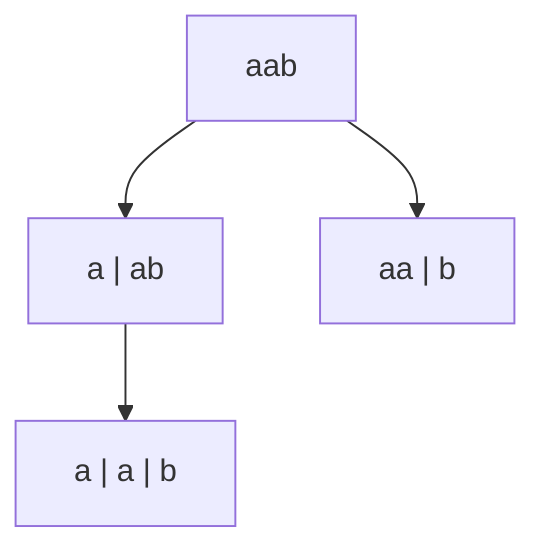

# 131. Palindrome Partitioning

**Difficulty:** Medium
**Category:** String, Dynamic Programming, Backtracking

## Problem

Given a string `s`, partition it such that every substring of the partition is a palindrome. Return all possible palindrome partitioning of `s`.

### Example 1

```
Input: s = "aab"
Output: [["a","a","b"],["aa","b"]]
```



### Example 2

```
Input: s = "a"
Output: [["a"]]
```

### Constraints

- `1 <= s.length <= 16`
- `s` consists of only lowercase English letters.

## Approach

Backtrack over cut positions: from the current starting index, try every possible substring ending at each subsequent index, and only recurse into it if that substring is itself a palindrome. Precomputing an `isPalindrome[i][j]` table with a simple DP pass avoids repeatedly re-checking substrings for palindrome-ness during backtracking.

## C# Solution

```csharp
public class Solution
{
    public IList<IList<string>> Partition(string s)
    {
        int n = s.Length;
        var isPalindrome = new bool[n, n];

        for (int end = 0; end < n; end++)
        {
            for (int start = end; start >= 0; start--)
            {
                if (s[start] == s[end] && (end - start <= 2 || isPalindrome[start + 1, end - 1]))
                {
                    isPalindrome[start, end] = true;
                }
            }
        }

        var result = new List<IList<string>>();
        Backtrack(s, 0, isPalindrome, new List<string>(), result);
        return result;
    }

    private void Backtrack(string s, int start, bool[,] isPalindrome, List<string> current, List<IList<string>> result)
    {
        if (start == s.Length)
        {
            result.Add(new List<string>(current));
            return;
        }

        for (int end = start; end < s.Length; end++)
        {
            if (!isPalindrome[start, end]) continue;

            current.Add(s.Substring(start, end - start + 1));
            Backtrack(s, end + 1, isPalindrome, current, result);
            current.RemoveAt(current.Count - 1);
        }
    }
}
```

## Complexity

- **Time:** `O(n * 2^n)` worst case — exponential partition count, pruned by the palindrome check.
- **Space:** `O(n^2)` — for the palindrome lookup table.
