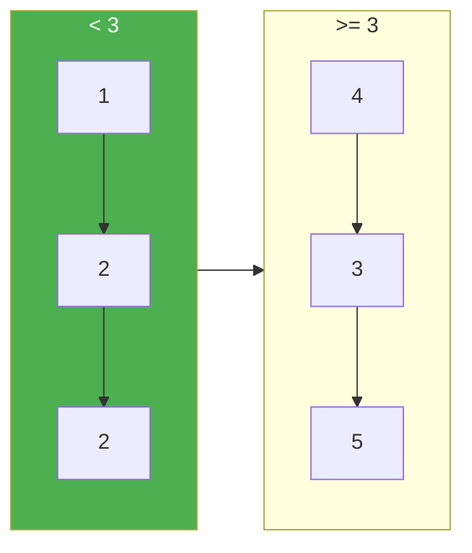

# 86. Partition List

**Difficulty:** Medium
**Category:** Linked List, Two Pointers

## Problem

Given the `head` of a linked list and a value `x`, partition it such that all nodes less than `x` come before nodes greater than or equal to `x`. Preserve the original relative order of the nodes in each partition.

### Example 1

```
Input: head = [1,4,3,2,5,2], x = 3
Output: [1,2,2,4,3,5]
```



### Example 2

```
Input: head = [2,1], x = 2
Output: [1,2]
```

### Constraints

- The number of nodes in the list is in the range `[0, 200]`.
- `-100 <= Node.val <= 100`
- `-200 <= x <= 200`

## Approach

Build two separate lists while walking the original once: a "less" list collecting nodes with value `< x`, and a "greater-or-equal" list collecting the rest, each maintained via its own dummy head and tail pointer. At the end, join the "less" list's tail to the "greater-or-equal" list's head.

## C# Solution

```csharp
public class Solution
{
    public ListNode Partition(ListNode head, int x)
    {
        var lessDummy = new ListNode();
        var greaterDummy = new ListNode();
        var lessTail = lessDummy;
        var greaterTail = greaterDummy;

        while (head != null)
        {
            if (head.val < x)
            {
                lessTail.next = head;
                lessTail = lessTail.next;
            }
            else
            {
                greaterTail.next = head;
                greaterTail = greaterTail.next;
            }

            head = head.next;
        }

        greaterTail.next = null; // avoid an accidental cycle
        lessTail.next = greaterDummy.next;
        return lessDummy.next;
    }
}
```

## Complexity

- **Time:** `O(n)` — single pass.
- **Space:** `O(1)` — nodes are relinked in place.
