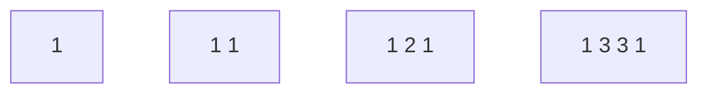

# 118. Pascal's Triangle

**Difficulty:** Easy
**Category:** Array, Dynamic Programming

## Problem

Given an integer `numRows`, return the first `numRows` of Pascal's triangle, where each number is the sum of the two numbers directly above it (edges of each row are `1`).

### Example 1

```
Input: numRows = 5
Output: [[1],[1,1],[1,2,1],[1,3,3,1],[1,4,6,4,1]]
```



### Example 2

```
Input: numRows = 1
Output: [[1]]
```

### Constraints

- `1 <= numRows <= 30`

## Approach

Build each row from the previous one: the first and last entries are always `1`, and every interior entry is the sum of the two entries above it (`prevRow[i-1] + prevRow[i]`).

## C# Solution

```csharp
public class Solution
{
    public IList<IList<int>> Generate(int numRows)
    {
        var result = new List<IList<int>>();

        for (int row = 0; row < numRows; row++)
        {
            var current = new List<int>(new int[row + 1]);
            current[0] = current[row] = 1;

            for (int col = 1; col < row; col++)
            {
                current[col] = result[row - 1][col - 1] + result[row - 1][col];
            }

            result.Add(current);
        }

        return result;
    }
}
```

## Complexity

- **Time:** `O(numRows^2)` — total number of triangle entries.
- **Space:** `O(1)` extra, excluding the output.
