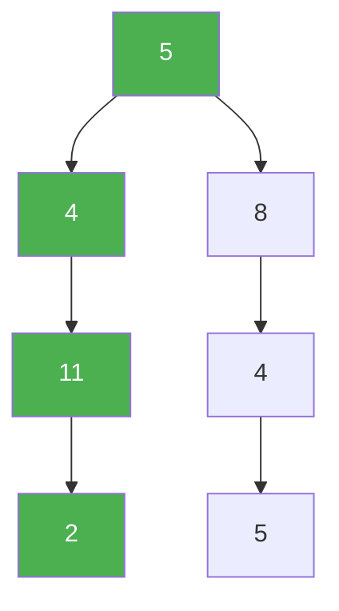

# 113. Path Sum II

**Difficulty:** Medium
**Category:** Backtracking, Tree, Depth-First Search, Binary Tree

## Problem

Given the `root` of a binary tree and an integer `targetSum`, return all root-to-leaf paths where each path's values sum to `targetSum`.

### Example 1

```
Input: root = [5,4,8,11,null,13,4,7,2,null,null,5,1], targetSum = 22
Output: [[5,4,11,2],[5,8,4,5]]
```



### Example 2

```
Input: root = [1,2,3], targetSum = 5
Output: []
```

### Constraints

- The number of nodes in the tree is in the range `[0, 5000]`.
- `-1000 <= Node.val <= 1000`
- `-1000 <= targetSum <= 1000`

## Approach

Backtrack while building a running path list: append the current node's value, recurse into both children with the reduced target, and record the path if a leaf is reached with exactly zero remaining. Remove the current node's value before returning (backtracking) so sibling branches don't see it.

## C# Solution

```csharp
public class Solution
{
    public IList<IList<int>> PathSum(TreeNode root, int targetSum)
    {
        var result = new List<IList<int>>();
        Backtrack(root, targetSum, new List<int>(), result);
        return result;
    }

    private void Backtrack(TreeNode node, int remaining, List<int> path, List<IList<int>> result)
    {
        if (node == null) return;

        path.Add(node.val);
        remaining -= node.val;

        if (node.left == null && node.right == null && remaining == 0)
        {
            result.Add(new List<int>(path));
        }
        else
        {
            Backtrack(node.left, remaining, path, result);
            Backtrack(node.right, remaining, path, result);
        }

        path.RemoveAt(path.Count - 1);
    }
}
```

## Complexity

- **Time:** `O(n^2)` worst case — `O(n)` root-to-leaf paths, each costing up to `O(n)` to copy.
- **Space:** `O(h)` for recursion depth, excluding the output.
