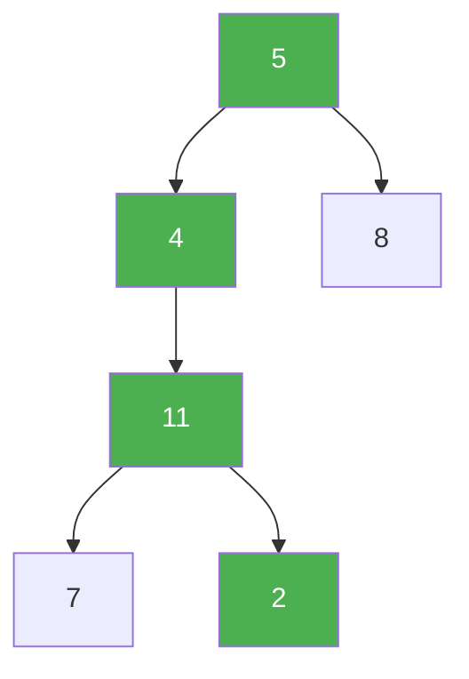

# 112. Path Sum

**Difficulty:** Easy
**Category:** Tree, Depth-First Search, Breadth-First Search, Binary Tree

## Problem

Given the `root` of a binary tree and an integer `targetSum`, return `true` if the tree has a root-to-leaf path such that adding up all the values along the path equals `targetSum`.

### Example 1

```
Input: root = [5,4,8,11,null,13,4,7,2,null,null,null,1], targetSum = 22
Output: true
Explanation: The path 5 -> 4 -> 11 -> 2 sums to 22.
```



### Example 2

```
Input: root = [1,2,3], targetSum = 5
Output: false
```

### Constraints

- The number of nodes in the tree is in the range `[0, 5000]`.
- `-1000 <= Node.val <= 1000`
- `-1000 <= targetSum <= 1000`

## Approach

Recursively subtract the current node's value from `targetSum` as you descend. At a leaf, the path sums to `targetSum` exactly when the remaining amount equals the leaf's own value. A node with no children at all (both null) is the base leaf check; an internal node with only one child must recurse into whichever child actually exists.

## C# Solution

```csharp
public class Solution
{
    public bool HasPathSum(TreeNode root, int targetSum)
    {
        if (root == null) return false;

        if (root.left == null && root.right == null)
        {
            return targetSum == root.val;
        }

        int remaining = targetSum - root.val;
        return HasPathSum(root.left, remaining) || HasPathSum(root.right, remaining);
    }
}
```

## Complexity

- **Time:** `O(n)` — every node is visited at most once.
- **Space:** `O(h)` — recursion depth equal to the tree height.
