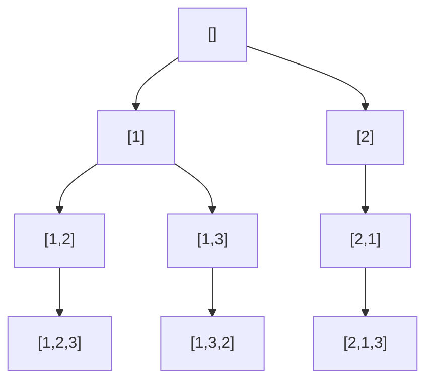

# 46. Permutations

**Difficulty:** Medium
**Category:** Array, Backtracking

## Problem

Given an array `nums` of distinct integers, return all the possible permutations. You can return the answer in any order.

### Example 1

```
Input: nums = [1,2,3]
Output: [[1,2,3],[1,3,2],[2,1,3],[2,3,1],[3,1,2],[3,2,1]]
```



### Example 2

```
Input: nums = [0,1]
Output: [[0,1],[1,0]]
```

### Constraints

- `1 <= nums.length <= 6`
- `-10 <= nums[i] <= 10`
- All the integers of `nums` are unique.

## Approach

Backtrack by swapping: at recursion depth `i`, try placing each remaining candidate (from index `i` to the end) at position `i` by swapping it into place, recurse for the next position, then swap back to restore the array for the next candidate.

## C# Solution

```csharp
public class Solution
{
    public IList<IList<int>> Permute(int[] nums)
    {
        var result = new List<IList<int>>();
        Backtrack(nums, 0, result);
        return result;
    }

    private void Backtrack(int[] nums, int start, List<IList<int>> result)
    {
        if (start == nums.Length)
        {
            result.Add(new List<int>(nums));
            return;
        }

        for (int i = start; i < nums.Length; i++)
        {
            (nums[start], nums[i]) = (nums[i], nums[start]);
            Backtrack(nums, start + 1, result);
            (nums[start], nums[i]) = (nums[i], nums[start]); // backtrack
        }
    }
}
```

## Complexity

- **Time:** `O(n * n!)` — `n!` permutations, each requiring `O(n)` to copy into the result.
- **Space:** `O(n)` for recursion depth, excluding the output.
