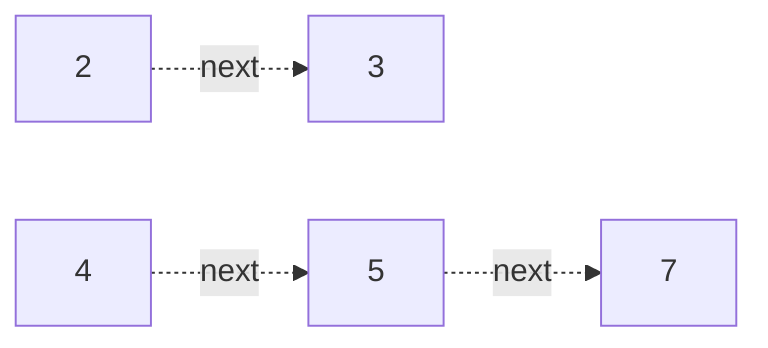

# 117. Populating Next Right Pointers in Each Node II

**Difficulty:** Medium
**Category:** Tree, Depth-First Search, Breadth-First Search, Binary Tree

## Problem

Given a binary tree (not necessarily perfect — any node may have zero, one, or two children), populate each `next` pointer to point to its next right node at the same level, or `null` if there is none.

### Example 1

```
Input: root = [1,2,3,4,5,null,7]
Output: [1,#,2,3,#,4,5,7,#]
```



### Example 2

```
Input: root = []
Output: []
```

### Constraints

- The number of nodes in the tree is in the range `[0, 6000]`.
- `-100 <= Node.val <= 100`

## Approach

Since the tree isn't perfect, use a dummy node to build the next level's linked chain as you walk the current level via its `next` pointers. For every node on the current level, attach any existing left/right children to the growing next-level chain in order, then move `leftmost` to the dummy's first attached child to start processing the next level.

## C# Solution

```csharp
public class Solution
{
    public Node Connect(Node root)
    {
        var current = root;

        while (current != null)
        {
            var dummy = new Node();
            var tail = dummy;

            while (current != null)
            {
                if (current.left != null)
                {
                    tail.next = current.left;
                    tail = tail.next;
                }
                if (current.right != null)
                {
                    tail.next = current.right;
                    tail = tail.next;
                }
                current = current.next;
            }

            current = dummy.next;
        }

        return root;
    }
}
```

## Complexity

- **Time:** `O(n)` — every node's pointers are set once.
- **Space:** `O(1)` — excluding the dummy nodes, which are discarded after each level.
