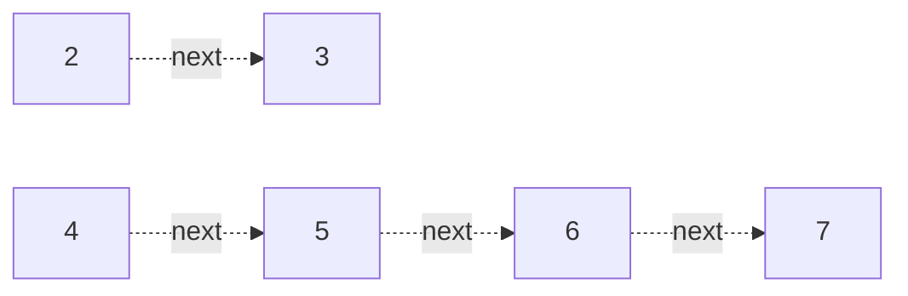

# 116. Populating Next Right Pointers in Each Node

**Difficulty:** Medium
**Category:** Tree, Depth-First Search, Breadth-First Search, Binary Tree

## Problem

You are given a perfect binary tree where all leaves are on the same level, and every parent has two children. Each node also has a `next` pointer. Populate each `next` pointer to point to its next right node at the same level, or `null` if there is no next right node.

### Example 1

```
Input: root = [1,2,3,4,5,6,7]
Output: [1,#,2,3,#,4,5,6,7,#]
Explanation: each level is connected left to right by 'next' pointers, terminated by '#'.
```



### Example 2

```
Input: root = []
Output: []
```

### Constraints

- The number of nodes in the tree is in the range `[0, 2^12 - 1]`.
- `-1000 <= Node.val <= 1000`

## Approach

Because the tree is perfect, once a level's `next` pointers are all set, the next level can be linked using only those pointers — no queue needed. Walk the current level using its leftmost node; for each node, link `node.left.next = node.right`, and `node.right.next = node.next.left` (if `node.next` exists). Move to the next level via the leftmost node's `left` child.

## C# Solution

```csharp
public class Node
{
    public int val;
    public Node left, right, next;
    public Node(int val = 0) { this.val = val; }
}

public class Solution
{
    public Node Connect(Node root)
    {
        var leftmost = root;

        while (leftmost != null && leftmost.left != null)
        {
            var current = leftmost;

            while (current != null)
            {
                current.left.next = current.right;
                if (current.next != null)
                {
                    current.right.next = current.next.left;
                }
                current = current.next;
            }

            leftmost = leftmost.left;
        }

        return root;
    }
}
```

## Complexity

- **Time:** `O(n)` — every node's pointers are set once.
- **Space:** `O(1)` — no queue or recursion stack is used.
